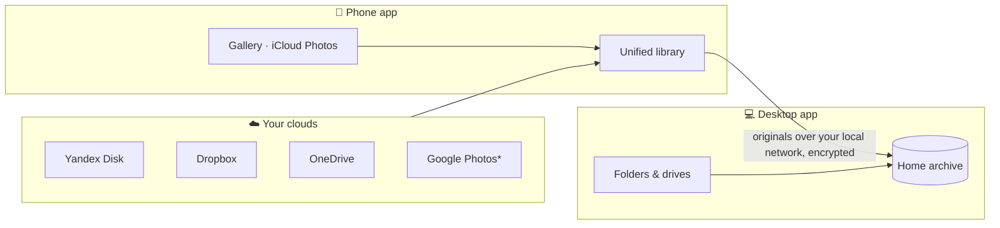

  

<h1 align="center">Pixroost</h1>

  <b>A home for every photo.</b> 
  Every photo from every cloud in one feed — no duplicates, no subscription, originals on your own computer.

  <a href="README.ru.md">Русский</a> ·
  <a href="docs/README.md">Docs</a> ·
  <a href="docs/roadmap.md">Roadmap</a> ·
  <a href="docs/process/conventions.md">Conventions</a>

  
  
  
  

> [!NOTE]
> Pixroost is in the **planning stage** — there is no code yet. This repository holds the product plan,
> architecture and conventions. Follow the [roadmap](docs/roadmap.md).

## Why

Photos end up scattered: some in iCloud, some in Google Photos, some on Yandex Disk — and the same shot
often lives in three places at once. Every cloud is full, and every one of them wants a monthly subscription.

Pixroost fixes this without selling you more storage:

- **One feed.** Photos and videos from your phone and your clouds in a single timeline, showing *where every copy lives*.
- **No duplicates.** Finds the same photo across clouds (and near-identical shots) and shows how much space you can free.
- **Home archive.** Pair your computers once with a QR code and send originals from your phone to your PC or Mac.
  The desktop app files them into folders by date.
- **No subscription.** Pixroost never stores your photos on its servers, so there's nothing to rent. It's free.

## How it works

* Google Photos only allows access to photos you pick, or a full import via Google Takeout on the desktop.

## Principles

1. **Your photos stay yours.** Nothing ever touches a Pixroost server.
2. **Nothing is deleted without proof.** A copy can only be removed if another byte-identical copy exists
   in a place you trust — and only after you confirm.
3. **Local first.** No account, no email: devices pair by QR code and talk directly on your network.
4. **Honest limits.** If a service doesn't allow access, the app says so and offers the best legitimate alternative.
5. **No tracking.** No analytics, no ads SDKs.

## Planned for v1.0

v1.0 targets **Android and Windows** (plus Linux) — everything we can build and publish for free.
**iOS and macOS come later**, once there is budget for a Mac and an Apple developer account.

| | Android | Windows / Linux |
|---|:---:|:---:|
| Unified library | ✅ | ✅ |
| Phone gallery | ✅ | — |
| Yandex Disk, Dropbox, OneDrive, WebDAV | ✅ | ✅ |
| Google Photos (picker) / Google Takeout import | ✅ / — | ✅ / ✅ |
| Folders, external drives, cloud sync folders | — | ✅ |
| Cross-cloud duplicates & safe cleanup | ✅ | ✅ |
| QR pairing, send to PC, auto-archive | ✅ | receives |

See the full [requirements](docs/product/requirements.md) and [roadmap](docs/roadmap.md).

## Tech

Kotlin Multiplatform · Compose Multiplatform · SQLDelight · Ktor · Koin · Coil —
[stack](docs/tech/stack.md) · [architecture](docs/architecture/overview.md) · [decisions](docs/architecture/adr/README.md).

## Documentation

Project documentation is written in Russian: start at the [docs index](docs/README.md).

## Contributing

Read [CONTRIBUTING.md](CONTRIBUTING.md) and the [branch & commit conventions](docs/process/conventions.md)
(Conventional Commits, `type/issue-short-name` branches, squash merges).

## License

[Apache License 2.0](LICENSE). The Pixroost name and logo are not covered by the license.
