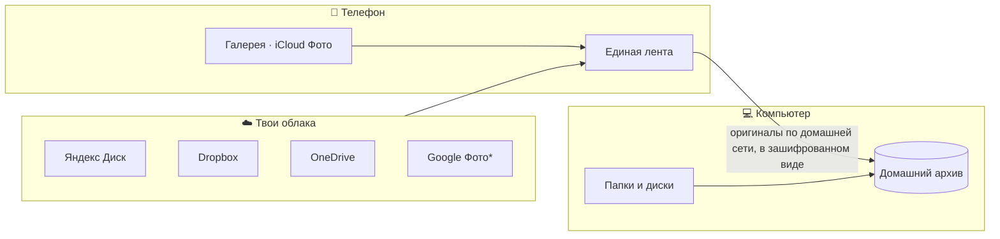

  

<h1 align="center">Pixroost</h1>

  <b>Дом для каждой фотографии.</b> 
  Все фото из всех облаков в одной ленте — без дублей, без подписки, оригиналы на твоём компьютере.

  <a href="README.md">English</a> ·
  <a href="docs/README.md">Документация</a> ·
  <a href="docs/roadmap.md">Роадмап</a> ·
  <a href="docs/process/conventions.md">Конвенции</a>

  
  
  
  

> [!NOTE]
> Pixroost на этапе **планирования** — кода пока нет. Здесь лежат план продукта, архитектура и конвенции.
> Следите за [роадмапом](docs/roadmap.md).

## Зачем

Фотографии разбросаны: часть в iCloud, часть в Google Фото, часть на Яндекс Диске — и один и тот же кадр
часто лежит в трёх местах сразу. Все облака забиты, и каждое просит ежемесячную подписку.

Pixroost решает это, не продавая ещё больше места:

- **Одна лента.** Фото и видео с телефона и из облаков на одной шкале времени, с отметкой, *где лежит каждая копия*.
- **Без дублей.** Находит одинаковые фото в разных облаках (и почти одинаковые кадры) и показывает, сколько места можно освободить.
- **Домашний архив.** Один раз связываешь компьютер с телефоном по QR-коду — и отправляешь оригиналы на ПК или Mac.
  Desktop-приложение раскладывает их по папкам с датами.
- **Без подписки.** Pixroost не хранит фото на своих серверах — платить не за что. Приложение бесплатное.

## Как это работает

* Google Фото даёт доступ только к выбранным фото; всю библиотеку можно импортировать на ПК через Google Takeout.

## Принципы

1. **Твои фото — твои.** Ничего не попадает на серверы Pixroost.
2. **Ничего не удаляется без доказательства.** Копию можно удалить, только если есть побайтово такая же
   в надёжном месте, и только после подтверждения.
3. **Локально в первую очередь.** Без аккаунта и почты: устройства связываются по QR и общаются напрямую в твоей сети.
4. **Честные ограничения.** Если сервис не даёт доступа, приложение так и говорит и предлагает лучший законный вариант.
5. **Без слежки.** Никакой аналитики и рекламных SDK.

## Что будет в v1.0

v1.0 выходит на **Android и Windows** (плюс Linux) — всё, что можно сделать и опубликовать бесплатно.
**iOS и macOS** разрабатываются параллельно, а выйдут позже, когда появятся деньги на аккаунт разработчика Apple.

| | Android | Windows / Linux |
|---|:---:|:---:|
| Единая лента | ✅ | ✅ |
| Галерея телефона | ✅ | — |
| Яндекс Диск, Dropbox, OneDrive, WebDAV | ✅ | ✅ |
| Google Фото (выбор) / импорт Google Takeout | ✅ / — | ✅ / ✅ |
| Папки, внешние диски, папки синхронизации облаков | — | ✅ |
| Дубли между облаками и безопасная уборка | ✅ | ✅ |
| Связка по QR, отправка на ПК, автоархив | ✅ | принимает |

Подробно — в [требованиях](docs/product/requirements.md) и [роадмапе](docs/roadmap.md).

## Технологии

Kotlin Multiplatform · Compose Multiplatform · Room · Ktor · Koin · Coil —
[стек](docs/tech/stack.md) · [архитектура](docs/architecture/overview.md) · [решения (ADR)](docs/architecture/adr/README.md).

## Участие

Прочитайте [CONTRIBUTING.md](CONTRIBUTING.md) и [конвенции веток и коммитов](docs/process/conventions.md)
(Conventional Commits, ветки `тип/issue-кратко`, squash-слияние).

## Лицензия

[Apache License 2.0](LICENSE). Название и логотип Pixroost лицензией не покрываются.
