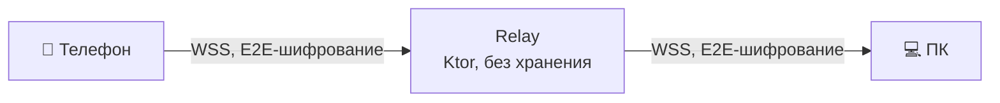

# Нужен ли бэкенд?

## Короткий ответ

**Для v1.0 — нет.** Всё, что обычно делает сервер, в Pixroost решается на устройствах пользователя.
Свой сервер появится в v1.1 — только как **relay** для передачи через интернет, без хранения данных и
без базы данных.

## Что обычно делает сервер и как мы обходимся без него

| Задача | Обычно | В Pixroost v1.0 |
|---|---|---|
| Аккаунт и вход | email + пароль, БД пользователей | связка устройств по QR, ключи на устройствах ([подробно](devices-and-transfer.md)) |
| «Видеть мои ПК на телефоне» | список устройств на сервере | локальная таблица `device` + mDNS в локальной сети |
| Передача фото | загрузка на сервер | напрямую телефон → ПК по локальной сети |
| Хранение фото | облако компании | ПК пользователя и его собственные облака |
| Доступ к облакам | серверная интеграция с секретами | OAuth PKCE прямо из приложения, токены на устройстве |
| Обновления desktop-версии | свой сервер обновлений | GitHub Releases (репозиторий публичный) |
| Отчёты о сбоях | Sentry / Crashlytics | App Store Connect и Google Play Console; на ПК — ручной экспорт журнала |
| Сайт | хостинг | GitHub Pages |

## Что это даёт

- **0 ₽ в месяц на инфраструктуру.** Бесплатный продукт может оставаться бесплатным.
- **Нет персональных данных на наших серверах** → минимум юридических обязательств (в том числе требований
  о локализации персональных данных), честная метка *Data Not Collected* в App Store.
- **Меньше поверхность атаки:** взламывать нечего, утечь нечему.
- **Работает, даже если проект закроется:** ПК-архив — обычная папка с файлами.

## Цена решения

- Нет восстановления «через почту»: потерял все устройства — связываешь новые заново.
  Фото при этом не теряются: они в архиве на ПК и в облаках.
- Без интернет-relay передача работает только в одной сети (это закрывает v1.1).
- Подключённые облака настраиваются на каждом устройстве отдельно (синхронизация настроек — v1.2).

## v1.1: relay для передачи через интернет

- **Что делает:** соединяет два сопряжённых устройства и пересылает зашифрованные кадры.
- **Чего не делает:** не хранит файлы, не видит содержимое (сквозное шифрование ключами устройств),
  не знает ни имени, ни почты пользователя.
- **Состояние:** только в памяти (кто сейчас в сети). База данных не нужна.
- **Авторизация:** устройство подписывает nonce своим ключом; relay пропускает трафик только между
  парой ключей, которые предъявили друг друга.
- **Защита от злоупотреблений:** лимиты скорости и объёма на пару устройств.
- **Стек:** Kotlin + Ktor (тот же язык и библиотеки, что в приложении), Docker, один небольшой VPS.
- **Стоимость:** от нескольких долларов в месяц; основная статья — трафик.
- **Альтернатива:** [iroh](https://www.iroh.computer/) — прямые соединения с пробивкой NAT, relay только как запасной
  вариант, трафик через сервер минимален. Выбор — по итогам спайка.
- **Где хостить:** решаем к v1.1 с учётом доступности оплаты, задержек и требований к данным.
  Relay не хранит персональные данные, но видит IP-адреса — это описываем в политике конфиденциальности.

## Дальше (v1.2+)

| Функция | Что понадобится |
|---|---|
| Синхронизация настроек и подключённых облаков между устройствами | Зашифрованный на устройстве «сейф» настроек. Можно передавать по сопряжённому каналу вообще без сервера |
| Push «фото сохранены на ПК», когда приложение закрыто | APNs / FCM / RuStore Push и небольшой сервис отправки |
| Веб-приложение | Web-клиент ходит к ПК через тот же relay |
| Необязательный аккаунт (восстановление, семья) | Сервис аккаунтов и БД (PostgreSQL). До этого — отдельное решение и ADR, с учётом законов о персональных данных |

Принцип сохраняется всегда: **сервер никогда не видит фотографии**.
