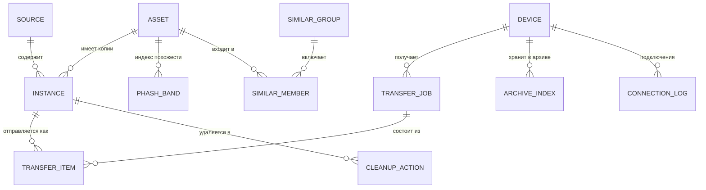

# Модель данных

У каждого устройства — **своя локальная база SQLite** с одной и той же схемой (SQLDelight).
Серверной базы данных в v1.0 нет.

Секреты (токены облаков, приватные ключи устройства) в базе **не хранятся** — только в защищённом
хранилище ОС (Keychain / Android Keystore / системный keyring), см. [безопасность](security-privacy.md).

## Главная идея: «фотография» и «копии»

Одна и та же фотография может лежать в пяти местах. Поэтому разделяем:

- **asset** — логическая фотография (или видео): «снимок заката 12 июля 2025 в 21:14»;
- **instance** — физическая копия в конкретном источнике: «файл `IMG_1234.HEIC` в Яндекс Диске, 3,1 МБ».

Лента показывает **assets**. Карточка «Где лежит» показывает все **instances** одного asset.
Дубли между облаками — это просто asset с несколькими instances.



## Схема (черновик)

```sql
-- Подключённые источники
CREATE TABLE source (
  id              INTEGER PRIMARY KEY,
  kind            TEXT    NOT NULL,  -- DEVICE_GALLERY, YANDEX_DISK, DROPBOX, ONEDRIVE, WEBDAV,
                                     -- GOOGLE_PHOTOS_PICKER, GOOGLE_TAKEOUT, LOCAL_FOLDER, HOMEROLL_ARCHIVE
  title           TEXT    NOT NULL,  -- «Яндекс Диск», «Архив на ПК-Дом»
  account_label   TEXT,              -- логин, который видит пользователь
  config_json     TEXT    NOT NULL DEFAULT '{}',
  sync_cursor     TEXT,              -- курсор инкрементальной синхронизации
  quota_total     INTEGER,
  quota_used      INTEGER,
  is_trusted      INTEGER NOT NULL DEFAULT 0,  -- «надёжное хранилище» для правила безопасности
  status          TEXT    NOT NULL,  -- OK, SYNCING, AUTH_REQUIRED, ERROR, DISABLED
  last_sync_at    INTEGER
);

-- Логическая фотография / видео
CREATE TABLE asset (
  id                INTEGER PRIMARY KEY,
  media_type        TEXT    NOT NULL,  -- PHOTO, VIDEO, LIVE_PHOTO
  taken_at          INTEGER,           -- UTC, мс; из EXIF DateTimeOriginal или метаданных источника
  tz_offset_min     INTEGER,
  width             INTEGER,
  height            INTEGER,
  duration_ms       INTEGER,
  phash             INTEGER,           -- 64-битный perceptual hash превью
  best_instance_id  INTEGER            -- копия лучшего качества (для просмотра)
);
CREATE INDEX asset_taken_at ON asset(taken_at DESC);

-- Физическая копия в источнике
CREATE TABLE instance (
  id             INTEGER PRIMARY KEY,
  asset_id       INTEGER NOT NULL REFERENCES asset(id),
  source_id      INTEGER NOT NULL REFERENCES source(id) ON DELETE CASCADE,
  remote_key     TEXT    NOT NULL,     -- id или путь внутри источника
  file_name      TEXT,
  mime_type      TEXT,
  size_bytes     INTEGER,
  md5            BLOB,                 -- если известен (от провайдера или посчитан)
  sha256         BLOB,                 -- если известен
  provider_hash  TEXT,                 -- хэш в формате провайдера: Dropbox content_hash, quickXorHash
  quality        TEXT    NOT NULL,     -- ORIGINAL, REDUCED, UNKNOWN
  modified_at    INTEGER,
  state          TEXT    NOT NULL,     -- PRESENT, TRASHED, MISSING
  verified_at    INTEGER,              -- когда содержимое сверено по SHA-256
  last_seen_at   INTEGER NOT NULL,
  UNIQUE (source_id, remote_key)
);
CREATE INDEX instance_asset  ON instance(asset_id);
CREATE INDEX instance_sha256 ON instance(sha256);
CREATE INDEX instance_md5    ON instance(md5);

-- Индекс для поиска похожих: 64-битный pHash, разрезанный на 4 «полосы» по 16 бит (LSH)
CREATE TABLE phash_band (
  asset_id  INTEGER NOT NULL REFERENCES asset(id) ON DELETE CASCADE,
  band      INTEGER NOT NULL,          -- 0..3
  value     INTEGER NOT NULL,          -- 16 бит
  PRIMARY KEY (band, value, asset_id)
);

-- Группы похожих кадров
CREATE TABLE similar_group (
  id          INTEGER PRIMARY KEY,
  kind        TEXT    NOT NULL,        -- SAME_SHOT (та же фотография, другое качество), SIMILAR (серия)
  created_at  INTEGER NOT NULL,
  dismissed   INTEGER NOT NULL DEFAULT 0
);
CREATE TABLE similar_member (
  group_id  INTEGER NOT NULL REFERENCES similar_group(id) ON DELETE CASCADE,
  asset_id  INTEGER NOT NULL REFERENCES asset(id) ON DELETE CASCADE,
  distance  INTEGER,
  PRIMARY KEY (group_id, asset_id)
);

-- Сопряжённые устройства
CREATE TABLE device (
  id                  TEXT    PRIMARY KEY,  -- UUID устройства
  name                TEXT    NOT NULL,
  platform            TEXT    NOT NULL,     -- ANDROID, IOS, MACOS, WINDOWS, LINUX
  role                TEXT    NOT NULL,     -- PHONE, DESKTOP
  public_key          BLOB    NOT NULL,     -- P-256, ключ устройства (Secure Enclave / Keystore)
  transport_key       BLOB,                 -- Ed25519, транспортный ключ для удалённого доступа
  cert_sha256         BLOB,                 -- отпечаток TLS-сертификата ПК (пиннинг)
  permissions         TEXT    NOT NULL,     -- UPLOAD, BROWSE, DOWNLOAD, REMOTE, MANAGE (через запятую)
  invited_by          TEXT,                 -- id устройства, которое пригласило (если не через QR на ПК)
  last_address        TEXT,
  last_seen_at        INTEGER,
  is_default_archive  INTEGER NOT NULL DEFAULT 0,
  paired_at           INTEGER NOT NULL,
  revoked_at          INTEGER               -- не NULL → ключ отозван, соединения отклоняются
);

-- Журнал подключений (ведёт ПК)
CREATE TABLE connection_log (
  id          INTEGER PRIMARY KEY,
  device_id   TEXT    NOT NULL,
  at          INTEGER NOT NULL,
  route       TEXT    NOT NULL,        -- LAN, REMOTE
  event       TEXT    NOT NULL,        -- PAIRED, CONNECTED, UPLOAD, DOWNLOAD, REJECTED_REVOKED, PAIRING_FAILED
  details     TEXT
);

-- Очередь передачи
CREATE TABLE transfer_job (
  id          INTEGER PRIMARY KEY,
  device_id   TEXT    NOT NULL REFERENCES device(id),
  kind        TEXT    NOT NULL,        -- MANUAL, AUTO_ARCHIVE
  status      TEXT    NOT NULL,        -- QUEUED, RUNNING, PAUSED, DONE, FAILED
  created_at  INTEGER NOT NULL
);
CREATE TABLE transfer_item (
  id           INTEGER PRIMARY KEY,
  job_id       INTEGER NOT NULL REFERENCES transfer_job(id) ON DELETE CASCADE,
  instance_id  INTEGER NOT NULL REFERENCES instance(id),
  upload_id    TEXT,                   -- id загрузки на стороне ПК (для докачки)
  bytes_total  INTEGER,
  bytes_sent   INTEGER NOT NULL DEFAULT 0,
  status       TEXT    NOT NULL,       -- QUEUED, UPLOADING, VERIFYING, DONE, SKIPPED_EXISTS, FAILED
  error        TEXT,
  saved_path   TEXT,
  finished_at  INTEGER
);

-- Кэш на телефоне: какие файлы уже есть в архиве на каждом ПК (синхронизируется с ПК)
CREATE TABLE archive_index (
  device_id   TEXT NOT NULL REFERENCES device(id) ON DELETE CASCADE,
  sha256      BLOB NOT NULL,
  saved_path  TEXT,
  PRIMARY KEY (device_id, sha256)
);

-- Журнал уборки
CREATE TABLE cleanup_action (
  id           INTEGER PRIMARY KEY,
  plan_id      TEXT    NOT NULL,
  instance_id  INTEGER NOT NULL REFERENCES instance(id),
  action       TEXT    NOT NULL,       -- TRASH
  status       TEXT    NOT NULL,       -- PLANNED, DONE, FAILED
  executed_at  INTEGER,
  error        TEXT
);
```

Схема — отправная точка; окончательная появится в модуле `:shared:database` и будет меняться только
через миграции.

## Как определяем одинаковые фото

Три уровня «одинаковости». Автоматически удалять можно **только первый**.

| Уровень | Как определяем | Пример | Что делаем |
|---|---|---|---|
| **1. Точная копия** | совпадает SHA-256 содержимого (или MD5 от двух провайдеров) | один и тот же `IMG_1234.HEIC` в iCloud, Яндексе и архиве на ПК | один asset, несколько instances; лишние копии можно удалить по правилу безопасности |
| **2. Тот же кадр, другое качество** | одинаковая дата съёмки (±1 с) + пропорции + pHash, расстояние Хэмминга ≤ 4 | оригинал в iCloud и сжатая копия в Google Фото | группа `SAME_SHOT`; предлагаем оставить лучшую копию, решает пользователь |
| **3. Похожие кадры** | pHash, расстояние ≤ 10, и разница во времени ≤ 60 с | серия из 8 снимков одного заката | группа `SIMILAR`; ничего не выбрано по умолчанию |

### Откуда берутся хэши

| Источник | Что есть сразу | Что считаем сами |
|---|---|---|
| Яндекс Диск | MD5, SHA-256 | — |
| Dropbox | `content_hash` | SHA-256 — только если нужно сравнить с другим источником |
| OneDrive | quickXorHash (и, возможно, SHA-1) | SHA-256 по требованию |
| Галерея, папки, Takeout | — | SHA-256 при индексации (локально это быстро) |
| Архив на ПК | SHA-256 — считается при приёме | — |

Для облака без подходящего хэша полный SHA-256 считается **только когда он нужен**: перед удалением,
при уборке. Это экономит трафик.

### Правило безопасности удаления

```
можно удалить копию C фотографии A, если:
  существует другая копия C' фотографии A, такая что
    C'.state = PRESENT
    и C'.sha256 = C.sha256 (проверено: verified_at не пустой)
    и C'.source.is_trusted = true
```

Правило реализовано в одном месте — сценарии `CleanupSafetyPolicy` — и покрыто тестами.

## Миграции

- Миграции SQLDelight (`.sqm`), проверка схемы в CI (`verifySqlDelightMigration`).
- Никаких «удалим базу и пересоздадим» после релиза: индексация большой медиатеки занимает время,
  а журнал уборки нельзя терять.
