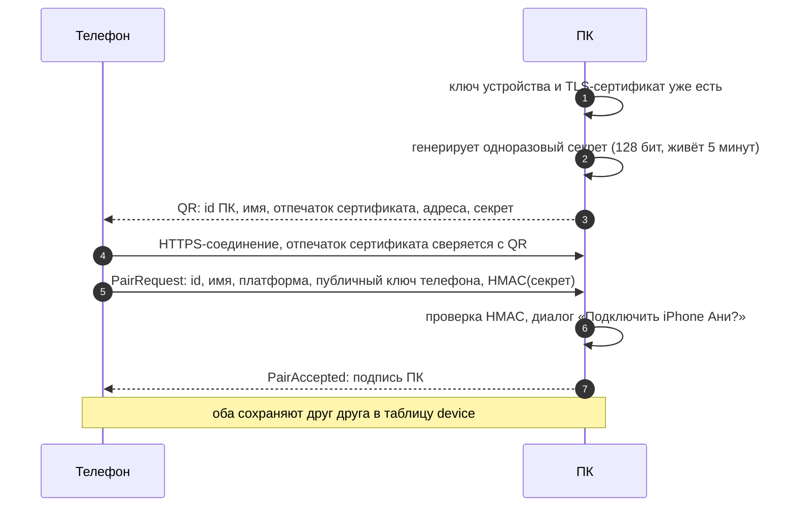
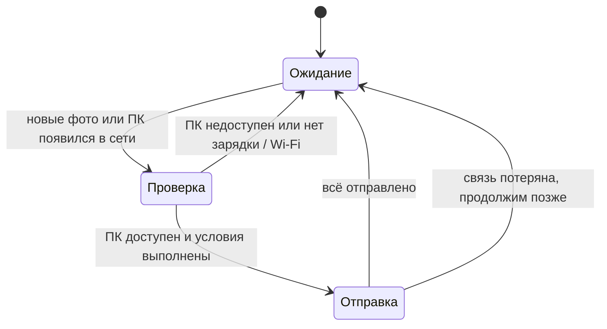

# Устройства и передача

Как телефон «видит» компьютеры, как связывается с ними без аккаунтов и как передаёт фото.

## Идея: вход как в Telegram Desktop

Вместо логина и пароля — **связка устройств по QR-коду**:

1. На ПК: «Добавить телефон» → на экране QR-код.
2. На телефоне: «Добавить ПК» → сканируем.
3. ПК спрашивает: «Подключить iPhone Ани?» → «Да».

Готово: телефон видит этот ПК в списке устройств, может отправлять ему фото и настраивать автоархив.
Можно связать несколько ПК. Почта, пароль и сервер для этого не нужны.

> **Ограничение v1.0:** телефон и ПК должны быть **в одной сети** (дома, в офисе).
> Передача через интернет — v1.1, см. [раздел ниже](#v11-передача-через-интернет).

## Криптография в двух словах

- Каждое устройство при первом запуске создаёт **ключ устройства** — пару ключей ECDSA P-256.
  Приватный ключ не покидает устройство: Keychain (на iPhone — Secure Enclave), Android Keystore,
  системный keyring на ПК.
- ПК делает из своего ключа **самоподписанный TLS-сертификат** для локального HTTPS-сервера.
- При сопряжении устройства обмениваются публичными ключами. Дальше они узнают друг друга по ключам,
  а не по IP-адресу или имени.
- Для удалённого доступа добавляется второй, **транспортный** ключ (Ed25519, если выберем iroh).
  Он без ключа устройства бесполезен. Двухслойная схема, права устройств, отзыв и модель угроз —
  в [безопасности и приватности](security-privacy.md#ключи-устройств).

## Сопряжение



Содержимое QR (URI):

```
pixroost://pair?v=1&id=<uuid ПК>&n=<имя>&fp=<SHA-256 сертификата, base64url>
               &a=<ip:port>,<ip:port>&s=<секрет, base64url>&exp=<unix time>
```

Почему это безопасно:

- **Подмена ПК** в сети не пройдёт: телефон проверяет отпечаток сертификата из QR (пиннинг).
- **Чужой телефон** не подключится: нужен секрет из QR, который виден только на экране ПК,
  плюс ручное подтверждение на ПК.
- **Перехват QR с фото экрана** бесполезен через 5 минут, а секрет одноразовый.

## Обнаружение в сети

- ПК объявляет сервис **mDNS / Bonjour** `_pixroost._tcp` с TXT-записью `id=<uuid>`, `v=1`. Отвечать на запросы
  телефона ПК может только с [правилом брандмауэра](#брандмауэр-windows), которое ставит установщик.
- Телефон ищет сервис и сравнивает `id` со списком сопряжённых ПК.
- Запасные варианты: последний известный адрес; ручной ввод IP.

| Платформа | Реализация | Что нужно |
|---|---|---|
| iOS | `NWBrowser` (Network.framework) | `NSLocalNetworkUsageDescription` и `NSBonjourServices` в Info.plist, системный запрос доступа к локальной сети |
| Android | `NsdManager` | на Android 12 хватает разрешений, которые выдаются при установке: `INTERNET`, `ACCESS_NETWORK_STATE`, `ACCESS_WIFI_STATE`, `CHANGE_WIFI_MULTICAST_STATE`. ⚠️ Проверить разрешение на доступ к локальной сети в Android 16+ |
| Desktop | JmDNS | [правило брандмауэра Windows](#брандмауэр-windows); на macOS — разрешение, если пользователь включил брандмауэр |

## Путь соединения

ПК — HTTPS-сервер, телефон всегда подключается к нему сам. Иначе не работает фоновая отправка на iPhone:
`URLSession` в фоне отправляет, только когда подключается сам, а ждать подключений в фоне iPhone не может.
Пользователь не выбирает путь и не настраивает сеть: приложение пробует пути по порядку и берёт первый рабочий.

| Где телефон | Путь | Что нужно |
|---|---|---|
| в одной сети с ПК | напрямую по Wi-Fi | правило брандмауэра для частных и общедоступных сетей, его ставит установщик |
| вне дома — v1.1 | через [ретранслятор](#v11-передача-через-интернет) | только исходящие соединения, правила брандмауэра не нужны |
| дома, но напрямую не вышло (VPN, изоляция устройств в гостевой сети) — v1.1 | через ретранслятор | то же |

Почему дома не всегда через ретранслятор, хотя так не нужны правила брандмауэра:

- **скорость:** дома — скорость Wi-Fi, через интернет — не больше исходящей скорости домашнего подключения;
- **без интернета** архив дома продолжает работать;
- **расходы:** весь трафик через ретранслятор оплачивает проект, для бесплатного приложения это неподъёмно
  ([ADR 0002](adr/0002-local-first-no-backend.md));
- **обещание продукта:** дома фото идут прямо на ПК пользователя.

### VPN

Когда включён VPN, телефон и ПК не находят друг друга ни одним способом (проверено в спайке S-04): VPN уводит
в туннель и трафик локальной сети. По той же причине с VPN не находятся сетевые принтеры и другие устройства
дома. Приложение не обходит VPN: если ПК не найден, а VPN включён, оно предлагает выключить VPN или разрешить
в нём доступ к локальной сети. На Android включённый VPN видно по `NetworkCapabilities.TRANSPORT_VPN`.

### Брандмауэр Windows

Брандмауэр Windows блокирует входящие соединения к программе без правила, даже из той же сети, и пропускает
ответы на соединения, которые ПК открыл сам. Правило ставит установка, окон брандмауэра пользователь не видит:

| Как установлен Pixroost | Правило для входящих | Что видит пользователь |
|---|---|---|
| Microsoft Store (MSIX) | объявлено в манифесте пакета (`windows.firewallRules`) | ничего |
| `.msi` из GitHub Releases | добавляет установщик | запрос прав администратора при установке, как у большинства программ |
| без установки (разработка) | — | Windows один раз спрашивает «Разрешить доступ?» |

Правило — для частных **и** общедоступных сетей. Windows 11 часто помечает домашнюю сеть как общедоступную, и
правило только для частных сетей тогда не действует: в [спайке S-03](https://github.com/intelbetteramd-sys/pixroost/issues/24) телефон получал таймаут, пока правило
не распространили на общедоступные сети. Значит, ПК принимает соединения и в чужих сетях, например в кафе.
Внутрь пускают только сопряжённые устройства: TLS с проверкой сертификата и вход по ключу устройства
([сессия](#сессия)). Закрывать ли порт в сетях, где не было сопряжения, решаем на
[шаге 4.2](../development-plan.md#фаза-4--устройства-и-передача--v02).

Что показал [спайк S-04](https://github.com/intelbetteramd-sys/pixroost/issues/23)
(Windows 11, Android 12, домашний Wi-Fi, сеть частная):

| | Правило для Java есть | Правил для Java нет |
|---|---|---|
| Телефон находит ПК по mDNS | за 0,4 с | только из кэша; через ~15 с ПК «пропадает» |
| Телефон подключается к ПК | за 38 мс | нет: таймаут |
| ПК находит телефон рассылкой «кто тут?» | ≈ 1 с | ≈ 1 с |
| ПК подключается к телефону | за 15 мс | за 4 мс |

Без правила Windows молча отбрасывает входящие пакеты, поэтому телефон видит не отказ, а тишину до таймаута.

### Развёрнутое подключение

Запасной путь, в v1.0 не используется. ПК сам подключается к телефону: для Windows это исходящее соединение,
и правило брандмауэра не нужно. Спайки [S-04](https://github.com/intelbetteramd-sys/pixroost/issues/23) и
[S-03](https://github.com/intelbetteramd-sys/pixroost/issues/24) показали, что на Android это работает в частной и
общедоступной сети, с докачкой после обрыва:

1. ПК раз в секунду рассылает «кто тут?» на широковещательные адреса своих сетей, телефон отвечает прямо на
   адрес ПК. Брандмауэр пропускает ответ: это ответ на пакет, который ПК отправил сам.
2. ПК держит открытыми несколько соединений к телефону. Когда телефон начинает передачу по одному из них, ПК
   пересылает его на свой HTTPS-сервер на `127.0.0.1`. TLS идёт напрямую между телефоном и сервером, протокол
   тот же.

В v1.0 развёрнутое подключение не используется: iPhone в фоне не может ждать подключений, а с правилом из
установщика прямой путь работает для всех устройств. Остаётся в запасе на случай, если правило окажется
недоступно.

## Сессия

1. TLS 1.3 к ПК с проверкой сертификата по сохранённому отпечатку.
2. `POST /v1/auth/challenge` → ПК возвращает случайный nonce.
3. Телефон подписывает `nonce ‖ id телефона` своим ключом → `POST /v1/auth/session` → короткоживущий токен.
   ПК проверяет, что ключ не отозван (`revoked_at`), и записывает подключение в журнал.
4. Дальше все запросы — с этим токеном. Каждый запрос проверяется по **правам устройства**
   (отправка, просмотр, скачивание, управление).

## Протокол передачи (v1)

HTTP/1.1 поверх HTTPS. Загрузка с докачкой в духе протокола [tus](https://tus.io/), проверена в
[спайке S-03](https://github.com/intelbetteramd-sys/pixroost/issues/24). Идентификатор загрузки — SHA-256 файла, поэтому докачка переживает перезапуск и телефона,
и ПК.

| Метод | Путь | Назначение |
|---|---|---|
| `POST` | `/v1/uploads` | Начать загрузку или найти начатую: SHA-256, размер, имя и метаданные (дата съёмки, тип, `groupId`). Ответ — смещение: сколько байт у ПК уже есть; или «уже в архиве» |
| `PATCH` | `/v1/uploads/{sha256}` | Остаток файла с заголовком `Upload-Offset`. Когда пришёл весь файл, ПК проверяет SHA-256, раскладывает файл и отвечает «готово». Новая попытка отменяет старую, зависшую на оборванном соединении |
| `HEAD` | `/v1/uploads/{sha256}` | Узнать смещение |
| `GET` | `/v1/archive/index?since=` | Список SHA-256 в архиве (для отметок «уже на ПК» на телефоне) |
| `GET` | `/v1/info` | Имя ПК, версия, свободное место |

Остаток файла уходит одним запросом: после обрыва телефон спрашивает смещение и досылает остальное. Фоновая
загрузка на iPhone отправляет только целый файл, поэтому для докачки телефон готовит временный файл с остатком.
Параллельно передаются 2–3 файла, большие — по одному. Порядок — от новых к старым (свежие фото важнее).

### Что показал спайк S-03

Android 12 (Redmi Note 9) → Windows 11, Wi-Fi 5 ГГц, оба устройства по Wi-Fi, сеть Windows помечена как
общедоступная. 20 фото по 3 МБ и видео 500 МБ со случайным содержимым:

| | Прямой путь (правило для всех сетей) | Развёрнутый путь (правил нет) |
|---|---|---|
| Фото, 20 × 3 МБ | 4,2 МБ/с | 3,5 МБ/с |
| Видео, 500 МБ | 4,7 МБ/с | 4,2 МБ/с |
| Wi-Fi выключен посреди видео | докачка с места обрыва через 0,9 с после возвращения Wi-Fi | докачка с места обрыва |

- SHA-256 совпал у всех файлов. Файл с тем же именем, но другим содержимым сохраняется как `имя (2)`.
- Скорость ограничена сетью: цель ≥ 20 МБ/с в этой сети не проверить. Развёрнутый путь медленнее на 10–15 %.
- Самоподписанный сертификат ПК — ECDSA P-256. На JVM его создаёт BouncyCastle: в JDK нет API для создания
  сертификатов.
- iPhone (фоновая `URLSession` с пиннингом) ещё не проверен на устройстве.

### Особенности медиа

- **Live Photo** — два ресурса (фото + видео) с общим `groupId`. ПК сохраняет их с одинаковым базовым именем
  (`IMG_1234.HEIC` + `IMG_1234.MOV`).
- **Отредактированные фото на iOS** — по умолчанию отправляется текущая версия. Опция: сохранять и оригинал.
- **Оригиналы из iCloud** — PhotoKit сначала скачивает оригинал во временный файл (с разрешением сети),
  затем файл отправляется на ПК.
- **Метаданные** не трогаем: файл передаётся байт-в-байт, EXIF сохраняется.

## Приём на ПК

- Файл пишется во временный `*.pixroost-partial` в папке архива, после проверки SHA-256 — атомарно переносится.
- Путь по правилу. По умолчанию — `{архив}/{год}/{год}-{месяц}/{имя}`.
  Доступные переменные: `{год}`, `{месяц}`, `{день}`, `{устройство}`, `{источник}`, `{имя}`.
- **Конфликт имён:** тот же хэш — пропускаем; другой хэш — `IMG_1234 (2).HEIC`.
- Дата изменения файла = дата съёмки (удобно в проводнике и Finder).
- Каждый принятый файл сразу попадает в локальную базу ПК как instance источника `PIXROOST_ARCHIVE`.

## Автоархив



- **Условие «я дома»** = сопряжённый ПК доступен в локальной сети. Не нужно читать имя Wi-Fi-сети
  (а это на обеих платформах требует доступа к геолокации).
- Дополнительные условия: только на зарядке, только без ограничения трафика.
- Новые фото отслеживаются через `PHPhotoLibraryChangeObserver` (iOS) и MediaStore (Android).

## v1.1: передача через интернет

Когда телефон и ПК в разных сетях, нужен посредник. Варианты — в [backend.md](backend.md):

- **Свой relay-сервер** (Ktor, WebSocket): устройства подключаются к нему по ключам, relay пересылает
  зашифрованные данные между двумя устройствами и **ничего не хранит**. Шифрование сквозное: ключ сессии
  выводится из ключей устройств (ECDH + HKDF), relay видит только шифротекст.
- **[iroh](https://www.iroh.computer/)**: прямое соединение по QUIC с пробивкой NAT, relay только как запасной вариант.
  Меньше трафика через сервер, но библиотека на Rust — нужна проверка интеграции с KMP.

Решение принимаем по итогам спайка перед v1.1.

## Что проверяем в прототипах (Фаза 1)

- Ktor Server на desktop + самоподписанный сертификат + пиннинг: на Android проверено в S-03, на iOS — нет.
- Background `URLSession` на iOS с пиннингом самоподписанного сертификата: продолжается ли загрузка в фоне (S-03).
- mDNS и системный запрос доступа к локальной сети на iOS; разрешение на доступ к локальной сети в
  Android 16+. Android 12 и Windows 11 проверены в S-04.
- Скорость: цель — ≥ 20 МБ/с по Wi-Fi 5 на современных устройствах. В сети спайка S-03 оба пути давали 4–5 МБ/с.
