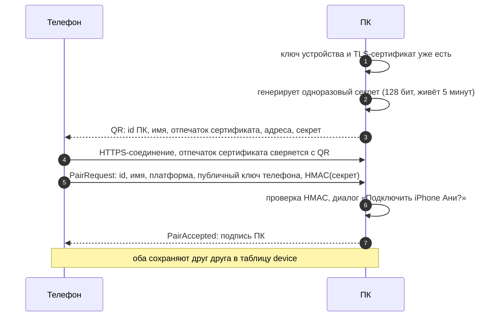
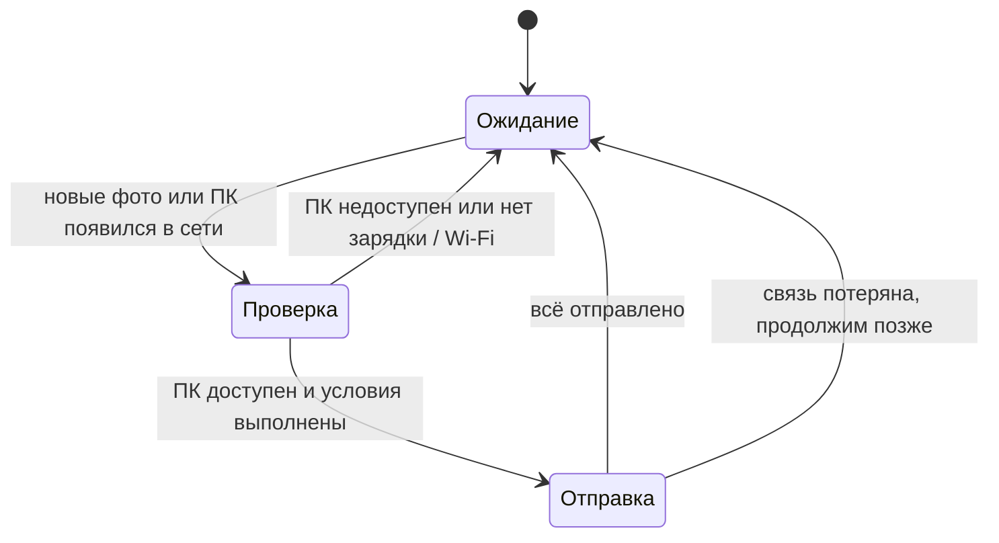

# Устройства и передача

Как телефон «видит» компьютеры, как связывается с ними без аккаунтов и как передаёт фото.

## Идея: вход как в Telegram Desktop

Вместо логина и пароля — **связка устройств по QR-коду**:

1. На ПК: «Добавить телефон» → на экране QR-код.
2. На телефоне: «Добавить ПК» → сканируем.
3. ПК спрашивает: «Подключить iPhone Ани?» → «Да».

Готово: телефон видит этот ПК в списке устройств, может отправлять ему фото и настраивать автоархив.
Можно связать несколько ПК. Почта, пароль и сервер для этого не нужны.

> **Ограничение v1.0:** телефон и ПК должны быть **в одной сети** (дома, в офисе).
> Передача через интернет — v1.1, см. [раздел ниже](#v11-передача-через-интернет).

## Криптография в двух словах

- Каждое устройство при первом запуске создаёт **ключ устройства** — пару ключей ECDSA P-256.
  Приватный ключ не покидает устройство: Keychain (на iPhone — Secure Enclave), Android Keystore,
  системный keyring на ПК.
- ПК делает из своего ключа **самоподписанный TLS-сертификат** для локального HTTPS-сервера.
- При сопряжении устройства обмениваются публичными ключами. Дальше они узнают друг друга по ключам,
  а не по IP-адресу или имени.
- Для удалённого доступа добавляется второй, **транспортный** ключ (Ed25519, если выберем iroh).
  Он без ключа устройства бесполезен. Двухслойная схема, права устройств, отзыв и модель угроз —
  в [безопасности и приватности](security-privacy.md#ключи-устройств).

## Сопряжение



Содержимое QR (URI):

```
pixroost://pair?v=1&id=<uuid ПК>&n=<имя>&fp=<SHA-256 сертификата, base64url>
               &a=<ip:port>,<ip:port>&s=<секрет, base64url>&exp=<unix time>
```

Почему это безопасно:

- **Подмена ПК** в сети не пройдёт: телефон проверяет отпечаток сертификата из QR (пиннинг).
- **Чужой телефон** не подключится: нужен секрет из QR, который виден только на экране ПК,
  плюс ручное подтверждение на ПК.
- **Перехват QR с фото экрана** бесполезен через 5 минут, а секрет одноразовый.

## Обнаружение в сети

- ПК объявляет сервис **mDNS / Bonjour** `_pixroost._tcp` с TXT-записью `id=<uuid>`, `v=1`.
- Телефон ищет сервис и сравнивает `id` со списком сопряжённых ПК.
- ПК раз в секунду рассылает по сети запрос «кто тут?», телефон отвечает. Так ПК находит телефон для
  [развёрнутого подключения](#развёрнутое-подключение), и правило брандмауэра для этого не нужно.
- Запасные варианты: последний известный адрес; ручной ввод IP.

| Платформа | Реализация | Что нужно |
|---|---|---|
| iOS | `NWBrowser` (Network.framework) | `NSLocalNetworkUsageDescription` и `NSBonjourServices` в Info.plist, системный запрос доступа к локальной сети |
| Android | `NsdManager`; ответ на рассылку ПК — UDP-сокет | на Android 12 хватает разрешений, которые выдаются при установке: `INTERNET`, `ACCESS_NETWORK_STATE`, `ACCESS_WIFI_STATE`, `CHANGE_WIFI_MULTICAST_STATE`. ⚠️ Проверить разрешение на доступ к локальной сети в Android 16+ |
| Desktop | JmDNS; рассылка «кто тут?» — UDP-сокет JDK | без [правила брандмауэра Windows](#брандмауэр-windows) ПК не отвечает на mDNS-запросы телефона; на macOS — разрешение, если пользователь включил брандмауэр |

## Путь соединения

Пользователь не выбирает путь и не настраивает сеть: приложение пробует пути по порядку и берёт первый рабочий.

| Где телефон | Путь | Что нужно |
|---|---|---|
| в одной сети с ПК | напрямую по Wi-Fi | ПК сам подключается к телефону ([развёрнутое подключение](#развёрнутое-подключение)), правило брандмауэра не нужно. Если правило есть (его ставит установка), телефон может подключиться к ПК и сам |
| вне дома — v1.1 | через [ретранслятор](#v11-передача-через-интернет) | только исходящие соединения, правила брандмауэра не нужны |
| дома, но напрямую не вышло — v1.1 | через ретранслятор | то же |

Почему дома не всегда через ретранслятор, хотя так не нужны правила брандмауэра:

- **скорость:** по Wi-Fi 30–80 МБ/с, через интернет — не больше исходящей скорости домашнего подключения,
  обычно 5–12 МБ/с. Первый архив в 100 ГБ — меньше часа против 3–5 часов;
- **без интернета** архив дома продолжает работать;
- **расходы:** весь трафик через ретранслятор оплачивает проект, для бесплатного приложения это неподъёмно
  ([ADR 0002](adr/0002-local-first-no-backend.md));
- **обещание продукта:** дома фото идут прямо на ПК пользователя.

### VPN

Когда включён VPN, телефон и ПК не находят друг друга ни одним способом (проверено в спайке S-04): VPN уводит
в туннель и трафик локальной сети. По той же причине с VPN не находятся сетевые принтеры и другие устройства
дома. Приложение не обходит VPN: если ПК не найден, а VPN включён, оно предлагает выключить VPN или разрешить
в нём доступ к локальной сети. На Android включённый VPN видно по `NetworkCapabilities.TRANSPORT_VPN`.

### Брандмауэр Windows

Брандмауэр Windows блокирует входящие соединения к программе без правила, даже из той же сети, и пропускает
ответы на соединения, которые ПК открыл сам. Задача — чтобы пользователь не видел его окон:

| Как установлен Pixroost | Правило для входящих | Что видит пользователь |
|---|---|---|
| Microsoft Store (MSIX) | объявлено в манифесте пакета (`windows.firewallRules`) | ничего |
| `.msi` из GitHub Releases | добавляет установщик | запрос прав администратора при установке, как у большинства программ |
| без установки (разработка) | — | Windows один раз спрашивает «Разрешить доступ?» |

Правило — только для частных сетей, чтобы ПК не принимал соединения, например, в кафе. Windows часто помечает
новую домашнюю сеть как общедоступную; тогда правило не действует и телефон к ПК не подключится. Развёрнутому
подключению это не мешает: ответы на пакеты, которые ПК отправил сам, брандмауэр пропускает в любом профиле
сети. В общедоступной сети спайк этого не проверял.

Что показал [спайк S-04](https://github.com/intelbetteramd-sys/pixroost/issues/23)
(Windows 11, Android 12, домашний Wi-Fi, сеть частная):

| | Правило для Java есть | Правил для Java нет |
|---|---|---|
| Телефон находит ПК по mDNS | за 0,4 с | только из кэша; через ~15 с ПК «пропадает» |
| Телефон подключается к ПК | за 38 мс | нет: таймаут |
| ПК находит телефон рассылкой «кто тут?» | ≈ 1 с | ≈ 1 с |
| ПК подключается к телефону | за 15 мс | за 4 мс |

Без правила Windows молча отбрасывает входящие пакеты, поэтому телефон видит не отказ, а тишину до таймаута.

### Развёрнутое подключение

ПК сам подключается к телефону. Для Windows это исходящее соединение, поэтому правило брандмауэра не нужно,
а `.msi` ставится без прав администратора. Дома это основной путь.
[Спайк S-04](https://github.com/intelbetteramd-sys/pixroost/issues/23) подтвердил, что он работает без правил:

1. Телефон, когда ему есть что отправить, слушает UDP-порт и ждёт ПК.
2. ПК раз в секунду рассылает запрос «кто тут?» на широковещательные адреса своих сетей.
3. Телефон отвечает прямо на адрес ПК. Брандмауэр пропускает этот ответ: это ответ на пакет, который ПК
   отправил сам.
4. ПК подключается к телефону по TCP.

ПК находит телефон примерно за секунду (это интервал рассылки) и подключается за единицы миллисекунд.

- mDNS для поиска телефона не годится: входящие mDNS-пакеты брандмауэр без правила блокирует так же, как
  любые входящие, а в спайке ПК видел телефон только из кэша JmDNS. Системная служба mDNS Windows (DNS-SD API)
  не понадобилась.
- Ответ телефона не выдаёт посторонним, чей это телефон: в нём только то, по чему его узнаёт сопряжённый ПК.
  Формат — при реализации ([шаг 4.4](../development-plan.md#фаза-4--устройства-и-передача--v02)).
- Меняется только направление подключения. Проверка сертификата, ключи устройств и права остаются такими же.
  Кто передаёт данные по соединению, которое открыл ПК (телефон отдаёт или ПК забирает), решает спайк S-03.
- Ограничение: на iOS фоновая загрузка через `URLSession` работает, только когда телефон подключается к ПК
  сам. Поэтому ПК продолжает принимать входящие соединения там, где правило есть.

## Сессия

1. TLS 1.3 к ПК с проверкой сертификата по сохранённому отпечатку.
2. `POST /v1/auth/challenge` → ПК возвращает случайный nonce.
3. Телефон подписывает `nonce ‖ id телефона` своим ключом → `POST /v1/auth/session` → короткоживущий токен.
   ПК проверяет, что ключ не отозван (`revoked_at`), и записывает подключение в журнал.
4. Дальше все запросы — с этим токеном. Каждый запрос проверяется по **правам устройства**
   (отправка, просмотр, скачивание, управление).

## Протокол передачи (v1)

HTTP/1.1 + JSON поверх HTTPS. Загрузка с докачкой в духе протокола [tus](https://tus.io/).

| Метод | Путь | Назначение |
|---|---|---|
| `POST` | `/v1/uploads` | Начать загрузку: `{sha256, size, name, takenAt, mime, groupId?}`. Ответ: `exists` (уже в архиве) или `uploadId` и `offset` |
| `HEAD` | `/v1/uploads/{id}` | Узнать смещение после обрыва |
| `PATCH` | `/v1/uploads/{id}` | Очередная часть (8 МБ), заголовок `Upload-Offset` |
| `POST` | `/v1/uploads/{id}/complete` | ПК проверяет SHA-256 и раскладывает файл. Ответ: путь в архиве |
| `GET` | `/v1/archive/index?since=` | Список SHA-256 в архиве (для отметок «уже на ПК» на телефоне) |
| `GET` | `/v1/info` | Имя ПК, версия, свободное место |

Параллельно передаются 2–3 файла. Порядок — от новых к старым (свежие фото важнее).

### Особенности медиа

- **Live Photo** — два ресурса (фото + видео) с общим `groupId`. ПК сохраняет их с одинаковым базовым именем
  (`IMG_1234.HEIC` + `IMG_1234.MOV`).
- **Отредактированные фото на iOS** — по умолчанию отправляется текущая версия. Опция: сохранять и оригинал.
- **Оригиналы из iCloud** — PhotoKit сначала скачивает оригинал во временный файл (с разрешением сети),
  затем файл отправляется на ПК.
- **Метаданные** не трогаем: файл передаётся байт-в-байт, EXIF сохраняется.

## Приём на ПК

- Файл пишется во временный `*.pixroost-partial` в папке архива, после проверки SHA-256 — атомарно переносится.
- Путь по правилу. По умолчанию — `{архив}/{год}/{год}-{месяц}/{имя}`.
  Доступные переменные: `{год}`, `{месяц}`, `{день}`, `{устройство}`, `{источник}`, `{имя}`.
- **Конфликт имён:** тот же хэш — пропускаем; другой хэш — `IMG_1234 (2).HEIC`.
- Дата изменения файла = дата съёмки (удобно в проводнике и Finder).
- Каждый принятый файл сразу попадает в локальную базу ПК как instance источника `PIXROOST_ARCHIVE`.

## Автоархив



- **Условие «я дома»** = сопряжённый ПК доступен в локальной сети. Не нужно читать имя Wi-Fi-сети
  (а это на обеих платформах требует доступа к геолокации).
- Дополнительные условия: только на зарядке, только без ограничения трафика.
- Новые фото отслеживаются через `PHPhotoLibraryChangeObserver` (iOS) и MediaStore (Android).

## v1.1: передача через интернет

Когда телефон и ПК в разных сетях, нужен посредник. Варианты — в [backend.md](backend.md):

- **Свой relay-сервер** (Ktor, WebSocket): устройства подключаются к нему по ключам, relay пересылает
  зашифрованные данные между двумя устройствами и **ничего не хранит**. Шифрование сквозное: ключ сессии
  выводится из ключей устройств (ECDH + HKDF), relay видит только шифротекст.
- **[iroh](https://www.iroh.computer/)**: прямое соединение по QUIC с пробивкой NAT, relay только как запасной вариант.
  Меньше трафика через сервер, но библиотека на Rust — нужна проверка интеграции с KMP.

Решение принимаем по итогам спайка перед v1.1.

## Что проверяем в прототипах (Фаза 1)

- Ktor Server на desktop + самоподписанный сертификат + пиннинг на iOS и Android.
- Background `URLSession` на iOS с пиннингом самоподписанного сертификата: продолжается ли загрузка в фоне.
- mDNS и системный запрос доступа к локальной сети на iOS; разрешение на доступ к локальной сети в
  Android 16+. Android 12 и Windows 11 проверены в S-04.
- Передача по развёрнутому подключению: кто отдаёт данные и с какой скоростью (S-03).
- Скорость: цель — ≥ 20 МБ/с по Wi-Fi 5 на современных устройствах.
