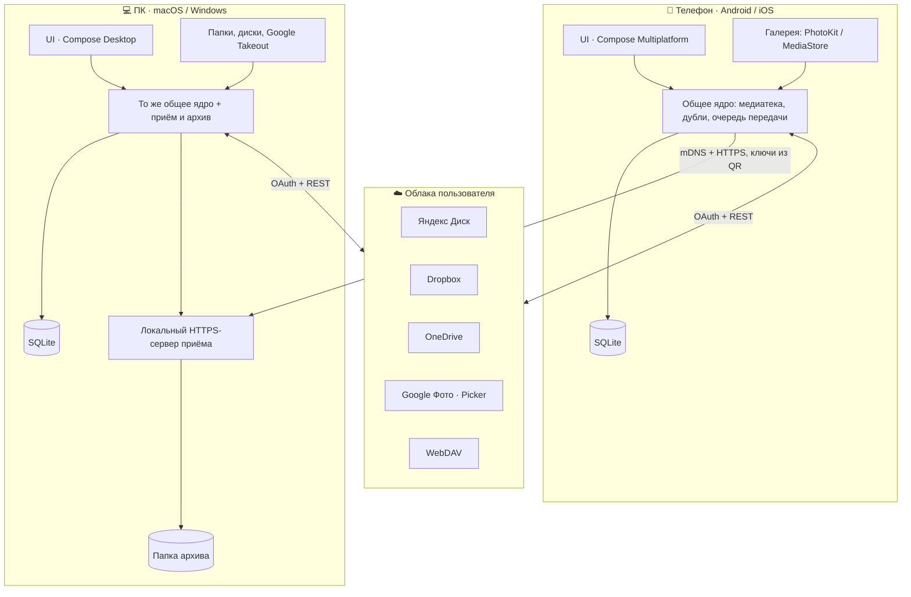
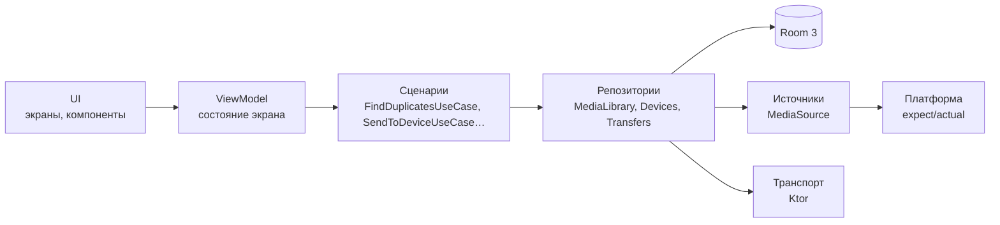
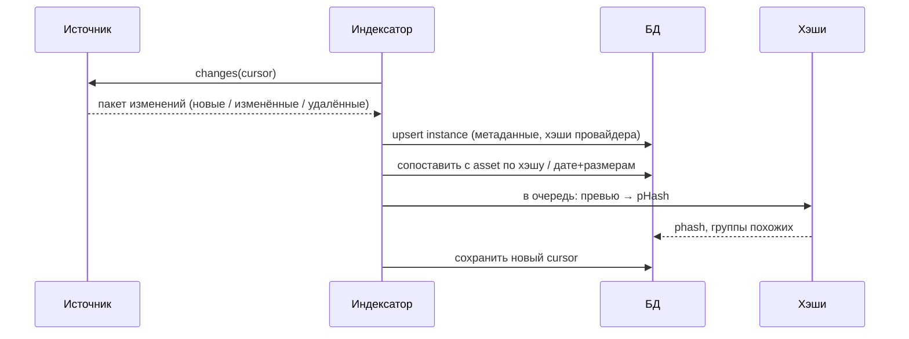
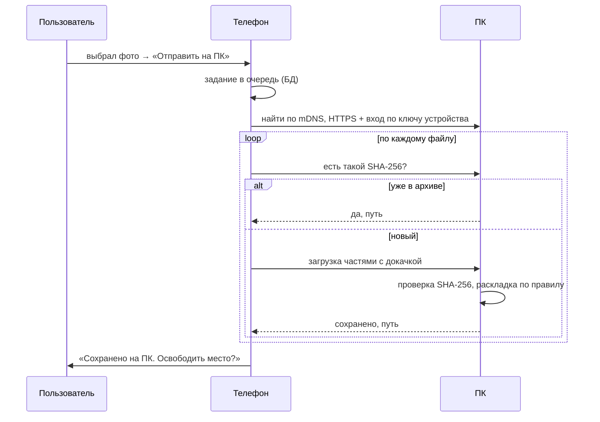

# Архитектура: обзор

## Цели

1. **Максимум общего кода.** Одна команда (сейчас — один человек) выпускает 4 платформы.
   Цель — 80–85% кода в общих модулях Kotlin Multiplatform.
2. **Local-first.** Всё работает на устройствах пользователя. Нет своего сервера в v1.0.
3. **Безопасность данных важнее скорости.** Любое удаление проходит через проверку копий.
4. **Масштаб.** Медиатеки на 50–100 тысяч элементов без тормозов.
5. **Заменяемые источники.** Новое облако подключается реализацией одного интерфейса.

## Общая картина

- **Телефон** — главный интерфейс: лента, дубли, отправка на ПК, автоархив.
- **ПК** — «домашнее облако»: принимает файлы, хранит архив, индексирует папки и диски,
  показывает ту же ленту на большом экране.
- **Облака** — подключаются напрямую с каждого устройства, токены хранятся на устройстве.
- **Серверов Pixroost нет** (в v1.0). Почему — см. [backend.md](backend.md).

## Слои

| Слой | Что внутри | Правило зависимостей |
|---|---|---|
| **UI** | Compose-экраны и компоненты дизайн-системы | знает только ViewModel и дизайн-систему |
| **ViewModel** | `StateFlow<UiState>`, обработка действий | знает сценарии, не знает платформу |
| **Сценарии** | бизнес-правила: правило безопасности удаления, правила раскладки | чистый Kotlin, 100% тестируемый |
| **Репозитории** | единая точка доступа к данным | скрывают, откуда данные (БД, сеть, источник) |
| **Источники / транспорт / БД** | коннекторы облаков, протокол передачи, SQL | Ktor и Room |
| **Платформа** | галерея, файлы, Keychain/Keystore, mDNS, фон, браузер для OAuth | интерфейсы в `commonMain`, реализации по платформам |

Однонаправленный поток данных: UI отправляет **действия** → ViewModel вызывает сценарии → репозитории
обновляют БД → БД отдаёт `Flow` → ViewModel собирает **состояние** → UI перерисовывается.
База данных — единственный источник правды для интерфейса.

## Что общее, а что платформенное

| Область | Общий код (`commonMain`) | Платформенный код |
|---|---|---|
| Интерфейс | все экраны и компоненты | плеер видео, камера для QR, системные диалоги удаления |
| Логика | медиатека, дубли, правила, очередь, протокол | — |
| Облака | коннекторы на Ktor | открытие браузера для OAuth |
| Данные | сущности, DAO и запросы Room | встроенный SQLite (`BundledSQLiteDriver`) |
| Платформа | интерфейсы | PhotoKit, MediaStore, Keychain / Keystore / keyring, mDNS, фоновые задачи |
| Desktop | — | трей, автозапуск, HTTPS-сервер приёма (Ktor Server на JVM) |

Swift-код на iOS и macOS — навигация на SwiftUI и то, что Compose не умеет или делает хуже системы
([ADR 0009](adr/0009-liquid-glass-native-navigation.md)).

## Ключевые потоки

### 1. Индексация источника

- Индексация идёт порциями в фоне, лента обновляется по мере поступления.
- Сначала метаданные (быстро), потом превью и perceptual hash (медленнее), потом — по требованию —
  полный SHA-256 (скачивание оригинала).
- Подробно о сопоставлении копий — в [модели данных](data-model.md#как-определяем-одинаковые-фото).

### 2. Отправка на ПК

Подробно — в [devices-and-transfer.md](devices-and-transfer.md).

### 3. Уборка

1. Сценарий `BuildCleanupPlan` собирает кандидатов на удаление по выбранным правилам.
2. Для каждого кандидата проверяется **правило безопасности**: у фотографии остаётся ≥ 1 проверенная
   копия (совпадение SHA-256) в надёжном месте. Если хэш копии неизвестен, файл сначала скачивается и
   проверяется — или кандидат исключается.
3. Пользователь видит сводку и подтверждает.
4. `ExecuteCleanupPlan` удаляет в корзину источника и пишет журнал `cleanup_action`.

## Фоновая работа

| Платформа | Механизм | Для чего |
|---|---|---|
| Android | WorkManager (constraints: сеть, зарядка) | индексация, автоархив, докачка |
| iOS | BGProcessingTask / BGAppRefreshTask, background `URLSession` ⚠️ проверить с самоподписанным сертификатом | индексация, автоархив, когда система позволит |
| Desktop | приложение работает постоянно (трей) | приём файлов, индексация папок, наблюдение за папками |

Ограничения iOS не обходим хитростями, а объясняем пользователю: «Откройте Pixroost дома — фото уедут на ПК».

## Ошибки и офлайн

- Любая сетевая операция идемпотентна и возобновляема: задания лежат в БД, а не в памяти.
- Ошибки источников отображаются на карточке источника («Нужно войти заново»), а не всплывающими окнами.
- Повторы — с экспоненциальной задержкой. Токены обновляются автоматически.

## Производительность

- **Лента:** запросы к БД с пагинацией (Paging 3 KMP), ключ — `taken_at`. Индексы — см. модель данных.
- **Превью:** Coil 3 с собственными загрузчиками для каждого источника, кэш в памяти и на диске.
  Для галереи — системные превью (PhotoKit / MediaStore), без скачивания оригиналов.
- **pHash:** считается по превью 64×64, в фоновом потоке, пакетами.
- **Поиск похожих:** 64-битный pHash, поиск по расстоянию Хэмминга через «полосы» (LSH) в SQLite.

## Тестирование

| Уровень | Что | Где |
|---|---|---|
| Unit | сценарии, правила, pHash, протокол, парсинг Takeout | `commonTest`, запускается на JVM в CI |
| Контракт | коннекторы облаков на записанных ответах API | `commonTest` + фикстуры |
| Интеграция | приём файлов сервером ПК, БД с миграциями | `desktopTest` |
| UI | ключевые экраны (Compose UI tests), скриншот-тесты компонентов | JVM / Android |
| E2E | онбординг, сопряжение, отправка — на реальных устройствах | вручную по чек-листу + Maestro для мобильных |

## Связанные документы

- [Модель данных](data-model.md)
- [Устройства и передача](devices-and-transfer.md)
- [Нужен ли бэкенд](backend.md)
- [Безопасность и приватность](security-privacy.md)
- [Стек](../tech/stack.md) · [Структура проекта](../tech/project-structure.md)
- [Архитектурные решения (ADR)](adr/README.md)
