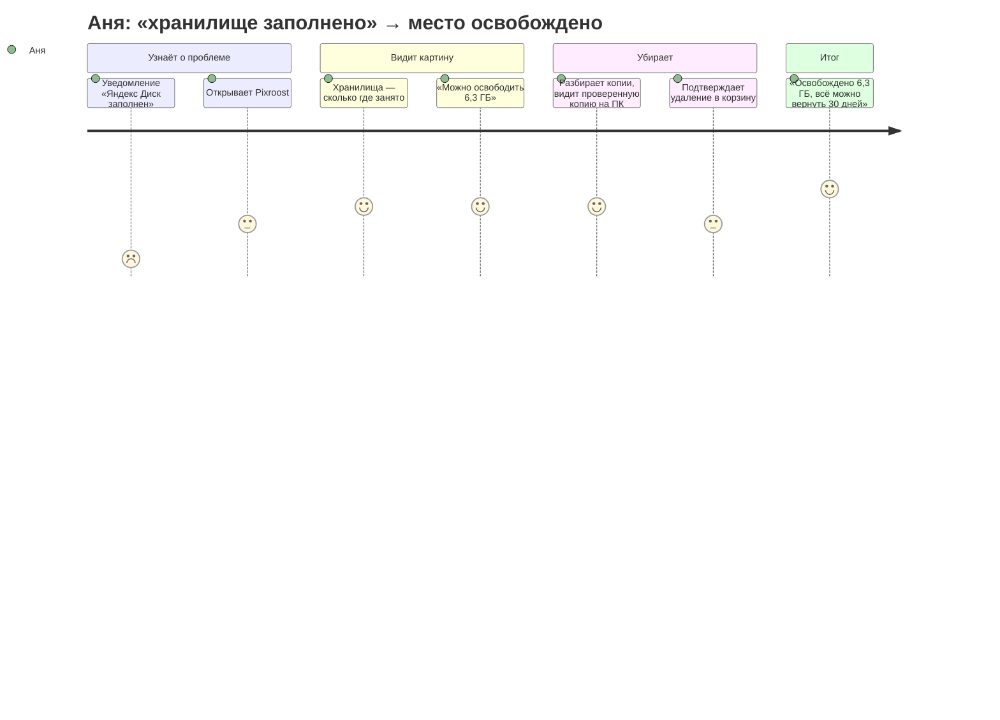
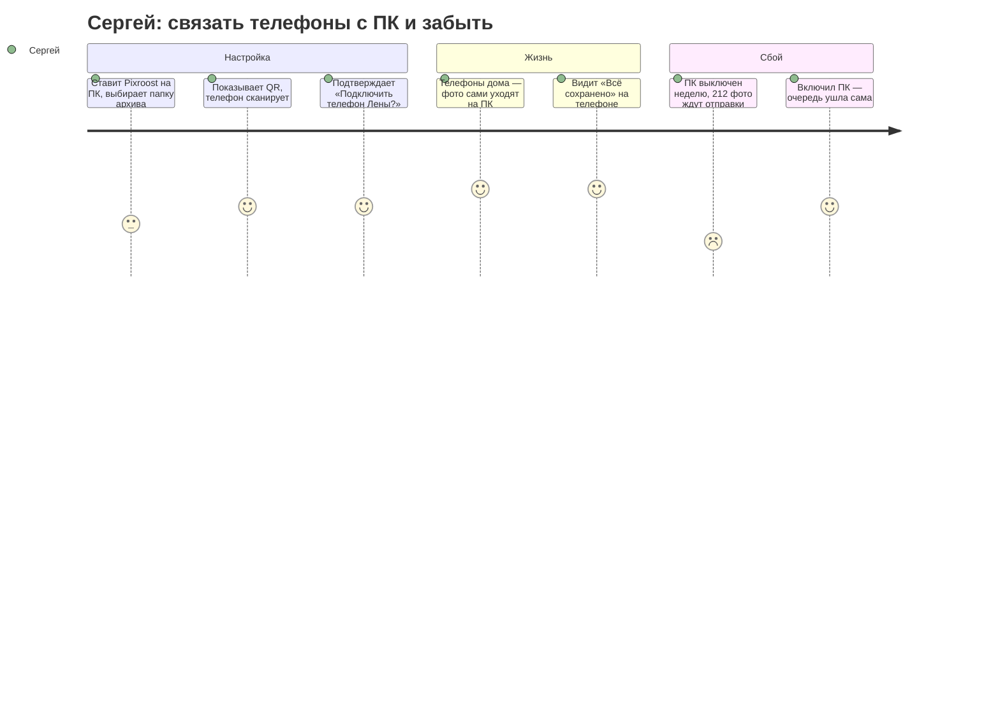
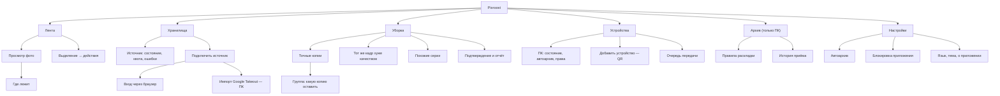

# Информационная архитектура

Как устроены разделы Pixroost, как их называть и как по ним ходить на каждой платформе.
Основа — [исследование](research.md). Макеты — на [холсте](README.md#макеты).

## Путь пользователя





## Карта разделов



## Навигация по платформам

Разделы одинаковые везде; меняется то, как по ним ходят. Порядок — по частоте использования.

```
ТЕЛЕФОН — Android (Material 3 Expressive)          ТЕЛЕФОН — iPhone (iOS 26)
┌───────────────────────────────┐                  ┌───────────────────────────────┐
│ Верхняя панель: заголовок,    │                  │ Крупный заголовок, кнопки     │
│ поиск, настройки              │                  │ на стекле справа              │
│                               │                  │                               │
│ Контент                       │                  │ Контент                       │
│      [плавающая панель        │                  │                               │
│       действий при выделении] │                  │   ( плавающая стеклянная      │
│ Лента Хранилища Уборка Устр.  │  ← нижняя        │     панель вкладок )          │
└───────────────────────────────┘    навигация     └───────────────────────────────┘

ПЛАНШЕТ (Android, iPad)                             ПК — Windows 11 / macOS
┌────┬─────────────────────┬──────────┐            ┌──────────┬────────────────────┬──────────┐
│ ▢  │ Лента               │ Где лежит│            │ Лента    │ Панель команд      │ Где лежит│
│ ▢  │ сетка               │ (панель  │            │ Хранилища│                    │ (панель  │
│ ▢  │                     │  деталей)│            │ Уборка   │ Сетка / списки     │  деталей)│
│ ▢  │                     │          │            │ Архив    │                    │          │
│ ⚙  │                     │          │            │ Устройства                    │          │
└────┴─────────────────────┴──────────┘            │ ──────── │                    │          │
 rail (Android) / сайдбар (iPad)                   │ Настройки│                    │          │
                                                   └──────────┴────────────────────┴──────────┘
                                                   + трей (Windows) / строка меню (macOS)
```

| Платформа | Основная навигация | Действия с выделенным | Детали фото |
|---|---|---|---|
| Android | компактная нижняя панель, 4 раздела | плавающая панель (Material 3 Expressive) | нижний лист |
| iPhone | плавающая стеклянная панель вкладок (iOS 26) | панель инструментов снизу | лист с уровнями высоты |
| Планшет | rail (Android) / сайдбар (iPad) | панель над сеткой | правая панель |
| Windows | левая навигация (NavigationView), фон Mica | панель команд сверху | правая панель |
| macOS | сайдбар, панель инструментов окна | панель инструментов | правая панель (инспектор) |

«Архив» есть только на ПК: это раздел про папку на диске этого компьютера. На телефоне архив виден как
источник «ПК „Дом“» в хранилищах и как метка на фото.

## Группировка и названия

| Раздел | Почему так | Как думает пользователь | Отвергнутые варианты |
|---|---|---|---|
| **Лента** | главное — все фото одним потоком | «мои фото» | «Медиатека» (слишком технично), «Фото» (путается с системной галереей) |
| **Хранилища** | все места, где лежат копии: телефон, облака, ПК | «где у меня что лежит и сколько занято» | «Облака» (а телефон и ПК?), «Источники» (жаргон) |
| **Уборка** | спокойное, бытовое действие | «навести порядок, освободить место» | «Очистка» (ассоциируется с «чистильщиками»-ловушками), «Дубли» (у́же, чем раздел) |
| **Устройства** | телефоны и компьютеры в связке | «мои компьютеры» | «ПК» (есть и телефоны), «Аккаунт» (аккаунта нет) |
| **Архив** (ПК) | папка на этом компьютере | «моя коробка с фото дома» | «Бэкап» (англицизм), «Хранилище» (путается с «Хранилищами») |

Словарь действий — одно слово на одно действие во всём приложении:

| Действие | Кнопка | Итог (тост, статус) |
|---|---|---|
| отправить на ПК | «Отправить на ПК» | «Отправлено на ПК „Дом“» |
| удалить в корзину источника | «Удалить из Яндекс Диска» | «Удалено из Яндекс Диска. Можно вернуть 30 дней» |
| подключить облако | «Подключить» | «Яндекс Диск подключён» |
| связать ПК | «Добавить ПК» / на ПК «Добавить телефон» | «ПК „Дом“ добавлен» |
| освободить место на телефоне | «Освободить место» | «Освобождено 2,4 ГБ» |

## Сценарии

### Основные (happy path)

1. **Первый запуск на телефоне:** зачем приложение → доступ к фото → лента галереи сразу работает →
   предложение подключить облако и ПК (можно пропустить).
2. **Освободить место:** Хранилища → «Можно освободить 6,3 ГБ» → Уборка (точные копии выбраны сами) →
   подтверждение со сводкой по источникам → отчёт.
3. **Где лежит фото:** Лента → фото → «Где лежит» → список копий с качеством и проверкой.
4. **Связать ПК:** на ПК «Добавить телефон» (QR) → на телефоне «Добавить ПК» → сканер → подтверждение на ПК.
5. **Отправить на ПК:** выделить фото → «Отправить на ПК» → очередь → «Сохранено на ПК „Дом“» →
   «Освободить место на телефоне?».
6. **Подключить облако:** Хранилища → «Подключить» → Яндекс Диск → вход в браузере → индексация с прогрессом.

### Краевые случаи

| Ситуация | Что видит пользователь |
|---|---|
| Ограниченный доступ к фото (Android 14+, iOS) | полоса над лентой: «Видны 120 выбранных фото» + «Открыть доступ ко всем» |
| 50 000+ фото | лента с быстрым скроллером по датам; индексация в фоне с прогрессом в «Хранилищах» |
| Нет ни облаков, ни ПК | лента галереи + дубли в галерее; спокойные предложения «Подключить облако», «Добавить ПК» |
| Google Фото | карточка с честным ограничением: «Google даёт доступ только к выбранным фото» + «Выбрать фото» и «Импорт всей библиотеки через Google Takeout на ПК» |
| Яндекс Диск на ПК без подписки | подсказка: «Приложение Диска для ПК стало платным — подключите Диск напрямую, это бесплатно» |
| ПК не в сети | на главном экране: «Ждёт ПК „Дом“: 34 фото» — отправятся сами, когда ПК появится |
| На телефоне мало места | карточка «На телефоне осталось 1,2 ГБ» → «Освободить место» (только то, что уже на ПК) |
| У фото нет проверенной копии | в уборке такие файлы не выбираются; причина видна: «Нет проверенной копии — сначала отправьте на ПК» |

### Редкие случаи

| Ситуация | Поведение |
|---|---|
| Два ПК | в «Устройствах» оба; один — «ПК для автоархива» |
| Устройство отозвано на ПК | телефон: «ПК „Дом“ больше не принимает этот телефон. Добавьте его заново» |
| Фото отредактировано после отправки | в «Где лежит» две версии: «оригинал на ПК» и «изменённая на телефоне» |
| iPhone с iCloud Фото | предупреждение перед «Освободить место»: «Удаление на iPhone удалит фото и из iCloud» |
| Токен облака истёк во время синхронизации | карточка источника «Нужно войти заново», остальное работает |

### Ошибки

| Ошибка | Сообщение (без извинений, с действием) |
|---|---|
| Облако недоступно | «Яндекс Диск не отвечает. Повторим через 5 минут» + «Повторить сейчас» |
| Передача прервалась | «Передача остановилась на 64%. Продолжится, когда ПК снова будет в сети» |
| Часть файлов не удалилась | отчёт: «2 файла, 6 МБ, не удалились: OneDrive не ответил» + «Повторить» |
| На ПК кончается место | телефон и ПК: «На диске D: осталось 3 ГБ. Выберите другую папку архива или освободите место» |
| Нет доступа к камере для QR | «Разрешите доступ к камере, чтобы отсканировать QR» + «Открыть настройки»; запасной путь — код с экрана ПК |

## Экраны для макетов

| Экран | Android | iPhone | Планшет | Windows | macOS |
|---|:---:|:---:|:---:|:---:|:---:|
| Первый запуск | ✅ | — | — | — | — |
| Лента | ✅ | ✅ тёмная тема | ✅ | ✅ | ✅ |
| Выбор фото и отправка на ПК | ✅ | — | — | — | — |
| Где лежит | ✅ | ✅ | в панели | в панели | в инспекторе |
| Хранилища | ✅ | — | — | — | — |
| Уборка: обзор и группа | ✅ | ✅ | — | ✅ | — |
| Подтверждение и отчёт | ✅ | — | — | — | — |
| Устройства и очередь | ✅ | ✅ | — | — | — |
| Сопряжение (QR) | ✅ сканер | — | — | ✅ показывает QR | — |
| Трей / строка меню | — | — | — | ✅ трей | ✅ строка меню |
| Состояния: ограниченный доступ, пусто, ошибка облака | ✅ | — | — | — | — |

Экраны без ✅ повторяют соседнюю платформу с её навигацией и в макеты не выносятся.
Список макетов с именами файлов — в [README](README.md#макеты).
