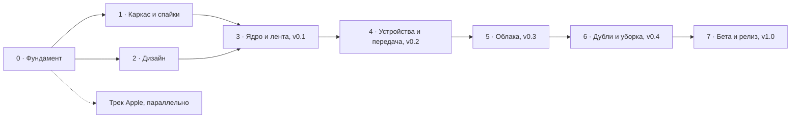

# План разработки по шагам

Как дойти до **v1.0 на Android и Windows** маленькими шагами. [Роадмап](roadmap.md) отвечает на вопрос
«что и в каком порядке», этот план — «как именно, по шагам».

- Шаг — это одна задача на GitHub и один или несколько небольших PR. Обычно шаг занимает 1–3 вечера.
- Оценки — в часах работы одного человека. При **~20 часах в неделю** весь план — около 8 месяцев
  чистой работы; с запасом на неожиданности — около 10 месяцев.
- Задачи на GitHub заводим **в начале фазы**: для фаз 0–2 они уже есть (номер шага — ссылка на задачу),
  для остальных — когда до них дойдём.
- Для каждого экрана есть макет на [холсте](design/README.md#макеты); в шагах указаны имена макетов
  (например, `Main`, `W-Library`).

## Как проходить шаг

1. Открыть задачу шага, назначить себя.
2. Ветка от свежего `main`: `<тип>/<номер задачи>-<коротко>`, например `feat/31-media-grid`.
3. Коммиты по [Conventional Commits](process/conventions.md). После шага 1.2 перед пушем — `.\gradlew check`.
4. PR по шаблону, в описании `Closes #<номер>`. Ждём зелёный CI.
5. Squash-слияние в `main`, ветка удаляется.
6. Отметить пункт в эпике фазы.

**Шаг готов, когда:** код в `main`, CI зелёный, новая логика покрыта тестами, строки интерфейса — в ресурсах
(RU, а с Фазы 7 и EN), документация в `docs/` обновлена, если поменялось поведение или архитектура.
Всё, что удаляет файлы пользователя, проходит через `CleanupSafetyPolicy` и покрыто тестами.

## Сводка

| Фаза | Результат | Часы | Недель при 20 ч |
|---|---|---:|---:|
| [0 · Фундамент](#фаза-0--фундамент) | компьютер готов к разработке | 6 | 0,5 |
| [1 · Каркас и спайки](#фаза-1--каркас-и-спайки) | проект собирается, риски сняты | 93 | 5 |
| [2 · Дизайн](#фаза-2--дизайн-остаток) | макеты утверждены, есть иконка | 25 | параллельно |
| [3 · Ядро и лента](#фаза-3--ядро-и-лента--v01) | `v0.1`: лента своих фото на телефоне и ПК | 160 | 8 |
| [4 · Устройства и передача](#фаза-4--устройства-и-передача--v02) | `v0.2`: фото сами уходят на ПК | 146 | 7,5 |
| [5 · Облака](#фаза-5--облака--v03) | `v0.3`: облака в общей ленте | 100 | 5 |
| [6 · Дубли и уборка](#фаза-6--дубли-и-уборка--v04) | `v0.4`: уборка освобождает место | 78 | 4 |
| [7 · Бета и релиз](#фаза-7--бета-и-релиз--v100) | `v1.0.0` в RuStore и Microsoft Store | 104 | 5 |
| **Итого** | | **712** | **~35** |
| [Трек Apple](#трек-apple--параллельно-и-бесплатно) | Pixroost на своём iPhone и Mac, решение по Liquid Glass | 46 | параллельно, в итог не входит |

## Фаза 0 · Фундамент

Эпик [#1](https://github.com/intelbetteramd-sys/pixroost/issues/1). Всё, кроме шага 0.1, делается на своём компьютере.

| № | Шаг | Что делаем | Готово, когда | Ч |
|---|---|---|---|---:|
| [0.1](https://github.com/intelbetteramd-sys/pixroost/issues/15) | Доделать настройки GitHub | по [настройке репозитория](process/repository-setup.md): только squash-слияние, автоудаление веток после слияния, удалить старые влитые ветки, темы (topics) в About | в Settings включено, на странице Branches только `main` | 1 |
| [0.2](https://github.com/intelbetteramd-sys/pixroost/issues/16) | Среда разработки на Windows | по [инструкции](process/dev-environment.md): Git, JDK 25, Android Studio с плагином Kotlin Multiplatform, Android SDK, эмулятор | `java -version` показывает 25 (или 26, если она уже стоит), эмулятор запускается | 3 |
| [0.3](https://github.com/intelbetteramd-sys/pixroost/issues/17) | Проверить среду | сгенерировать шаблон на kmp.jetbrains.com (Android, iOS, Desktop), запустить на эмуляторе и на Windows (`.\gradlew :desktopApp:run`), APK поставить на телефон через Telegram. В репозиторий не коммитим | приложение работает в эмуляторе, на телефоне и на Windows | 2 |

## Фаза 1 · Каркас и спайки

Эпик [#2](https://github.com/intelbetteramd-sys/pixroost/issues/2). Сначала каркас (1.1–1.4), потом спайки в любом порядке. Каждый спайк — ветка `spike/<номер>-<коротко>`,
код спайка в `main` не вливаем, итог — отчёт комментарием в задаче: что получилось, цифры, решение.

| № | Шаг | Что делаем | Готово, когда | Ч |
|---|---|---|---|---:|
| [1.1](https://github.com/intelbetteramd-sys/pixroost/issues/18) | Каркас Gradle | `settings.gradle.kts`, `gradle/libs.versions.toml`, `build-logic` с convention-плагинами (KMP-библиотека, Compose, Android-приложение, desktop-приложение); модули `shared/core`, `shared/designsystem`, `apps/android`, `apps/desktop` по [структуре](tech/project-structure.md). JDK 25 через toolchain Gradle — скачивается сам. iOS-таргеты объявлены: на Windows не собираются, на Mac и в CI — да ([трек Apple](#трек-apple--параллельно-и-бесплатно)) | `.\gradlew :apps:android:installDebug` на эмуляторе и `.\gradlew :apps:desktop:run` показывают экран «Pixroost» | 12 |
| [1.2](https://github.com/intelbetteramd-sys/pixroost/issues/19) | Качество кода | Spotless + ktlint, detekt, Kover; правила в `.editorconfig` | `gradlew check` зелёный локально | 5 |
| [1.3](https://github.com/intelbetteramd-sys/pixroost/issues/20) | CI | `ci.yml` по [CI/CD](tech/ci-cd.md): `check`, сборка Android, сборка desktop на Linux и Windows, кэш Gradle; debug-APK как артефакт, чтобы ставить на телефон без ПК; проверку CI сделать обязательной в ruleset | PR с ошибкой стиля или теста не сливается, APK скачивается на телефоне | 6 |
| [1.4](https://github.com/intelbetteramd-sys/pixroost/issues/21) | Dependabot для Gradle | добавить `gradle` в `.github/dependabot.yml` (GitHub Actions уже там) | приходят PR с обновлениями библиотек | 1 |
| [1.5](https://github.com/intelbetteramd-sys/pixroost/issues/22) | Спайк S-02: галерея Android | MediaStore, сетка 10 000 превью, частичный доступ Android 14+ | прокрутка без рывков на своём телефоне, решение про пагинацию | 12 |
| [1.6](https://github.com/intelbetteramd-sys/pixroost/issues/23) | Спайк S-04: поиск ПК в сети | mDNS `_pixroost._tcp`: NsdManager на Android, JmDNS на Windows; правило брандмауэра Windows; [развёрнутое подключение](architecture/devices-and-transfer.md#развёрнутое-подключение) без правила | телефон находит ПК за < 3 с; известно, работает ли передача без окон брандмауэра | 8 |
| [1.7](https://github.com/intelbetteramd-sys/pixroost/issues/24) | Спайк S-03: передача на ПК | передача по [развёрнутому подключению](architecture/devices-and-transfer.md#развёрнутое-подключение), которое открывает ПК (итог S-04): ПК забирает файлы с HTTPS-сервера на телефоне или телефон отдаёт их по этому соединению сам; Ktor, самоподписанный сертификат, пиннинг, докачка после обрыва | ≥ 20 МБ/с по Wi-Fi, обрыв посередине не ломает файл | 16 |
| [1.8](https://github.com/intelbetteramd-sys/pixroost/issues/25) | Спайк S-05: вход в облака | OAuth PKCE для Яндекса, Dropbox, Microsoft через Custom Tabs и loopback на ПК; Google Photos Picker | вход без секрета в приложении, токен в Keystore | 12 |
| [1.9](https://github.com/intelbetteramd-sys/pixroost/issues/26) | Спайк S-06: похожие фото | pHash на 1 000 своих фото | «тот же кадр, другое качество» находится с точностью ≥ 95% | 10 |
| [1.10](https://github.com/intelbetteramd-sys/pixroost/issues/27) | Спайк S-07: установщик Windows | `.msi` и MSIX, трей, автозапуск; правило брандмауэра для прямого пути: `windows.firewallRules` в MSIX, действие установщика `.msi` | ставится и запускается на чистой Windows | 8 |
| [1.11](https://github.com/intelbetteramd-sys/pixroost/issues/28) | Итоги спайков | обновить [ADR 0005](architecture/adr/0005-lan-transport.md), [стек](tech/stack.md); новое ADR, если решение поменялось | все решения записаны | 3 |

## Фаза 2 · Дизайн (остаток)

Эпик [#3](https://github.com/intelbetteramd-sys/pixroost/issues/3). Идёт параллельно с Фазой 1. Исследование, архитектура экранов и 125 макетов уже готовы: Android, Windows,
iPhone, iPad и macOS в светлой и тёмной теме.

| № | Шаг | Что делаем | Готово, когда | Ч |
|---|---|---|---|---:|
| [2.1](https://github.com/intelbetteramd-sys/pixroost/issues/29) | Ревью макетов | пройти холст, оставить комментарии, решить, что меняем | список правок согласован и внесён | 3 |
| [2.2](https://github.com/intelbetteramd-sys/pixroost/issues/30) | Логотип и иконка | на основе знака «свет в окне»: адаптивная иконка Android, `.ico` для Windows, иконка трея, заменить `docs/assets/logo.svg` | иконки лежат в репозитории, README с новым логотипом | 8 |
| [2.3](https://github.com/intelbetteramd-sys/pixroost/issues/31) | Проверка прототипа | кликабельный прототип Android на 5 знакомых: понимают ли «Точные копии», верят ли, что удаление безопасно | отчёт в задаче, правки в макетах | 8 |
| [2.4](https://github.com/intelbetteramd-sys/pixroost/issues/32) | Макет сайта | лендинг, политика, FAQ в той же визуальной системе | макеты на холсте | 6 |

## Фаза 3 · Ядро и лента → `v0.1`

Эпик [#4](https://github.com/intelbetteramd-sys/pixroost/issues/4). Результат: на телефоне и ПК видна лента своих фото, 50 000 элементов прокручиваются без рывков.

| № | Шаг | Что делаем | Макеты | Ч |
|---|---|---|---|---:|
| 3.1 | Тема и токены | `PixroostTheme`: цвета-роли светлой и тёмной темы, шрифты Unbounded и Onest внутри приложения (лицензия OFL в `NOTICE`), отступы, скругления; скриншот-тесты Roborazzi | `DS-Tokens` | 10 |
| 3.2 | Базовые компоненты | `PrimaryButton` и другие кнопки, `LabeledIconButton`, `StatusBadge`, `LampMark`, `SourceMark`, `LibraryFilters`, `SettingSwitch`, `ArchiveStatus` со скриншот-тестами | `DS-Components` | 14 |
| 3.3 | Основа | `shared/core`: `Result` и ошибки, логи Kermit, диспетчеры корутин, часы | — | 4 |
| 3.4 | Навигация и DI | Koin, Navigation 3; разделы: 4 на телефоне, 5 на ПК | `Main`, `W-Library` | 8 |
| 3.5 | База данных | Room 3 по [модели данных](architecture/data-model.md) и [ADR 0010](architecture/adr/0010-room3.md): сущности, DAO, экспорт схемы, тесты запросов и миграций | — | 12 |
| 3.6 | Интерфейс источников | `MediaSource`, общие модели, фейковый источник для тестов | — | 6 |
| 3.7 | Галерея Android | индексатор MediaStore: полный проход, изменения по поколениям (Android 11+), удалённые — сравнением ID; частичный доступ Android 14+ ([итог S-02](https://github.com/intelbetteramd-sys/pixroost/issues/22)) | `A-Start` | 16 |
| 3.8 | Папки на ПК | обход папок, слежение за изменениями, SHA-256 | `W-Storages` | 10 |
| 3.9 | Медиатека | объединение источников в одну ленту, группировка по датам, пагинация | — | 12 |
| 3.10 | Превью | загрузчики Coil 3 для галереи и папок, дисковый кэш; галерея — `loadThumbnail`, запасной путь для Android 8–9 | — | 8 |
| 3.11 | Лента | сетка, заголовки дат, быстрый скроллер, фильтры, метки мест; тест на 50 000 элементов | `Main`, `W-Library`, `T-Library` | 20 |
| 3.12 | Просмотр и «Где лежит» | просмотр фото и видео; «Где лежит» — лист на телефоне, панель на планшете и ПК | `A-Photo`, `W-Library` | 12 |
| 3.13 | Первый запуск Android | экран приветствия, разрешение на фото, ограниченный доступ | `A-Onboarding`, `A-Start` | 10 |
| 3.14 | Оболочка ПК | окно, навигация слева, трей, автозапуск, первый запуск с выбором папки архива | `W-Welcome`, `W-Tray` | 14 |
| 3.15 | Выпуск `v0.1` | ключ подписи Android в секретах GitHub, APK и `.msi` как pre-release | — | 4 |

## Фаза 4 · Устройства и передача → `v0.2`

Эпик [#5](https://github.com/intelbetteramd-sys/pixroost/issues/5). Результат: семья из 2 телефонов неделю пользуется автоархивом без потерь и дублей.

| № | Шаг | Что делаем | Макеты | Ч |
|---|---|---|---|---:|
| 4.1 | Ключи устройств | генерация ключа, Android Keystore, хранилище ключей Windows ([ADR 0007](architecture/adr/0007-device-keys-and-trust.md)) | — | 10 |
| 4.2 | Сервер приёма на ПК | Ktor Server, TLS-сертификат из ключа ПК | — | 10 |
| 4.3 | Сопряжение по QR | QR с одноразовым секретом на 5 минут, сканер (CameraX + ZXing), пиннинг, подтверждение на ПК, код вручную | `W-Pair`, `W-PairConfirm`, `A-Pair`, `A-PairConfirm` | 20 |
| 4.4 | Поиск ПК | рассылка «кто тут?» от ПК и ответ телефона, mDNS для прямого пути, подсказка про VPN, статус «в сети / не в сети» | `A-Devices` | 6 |
| 4.5 | Протокол передачи | докачка, проверка SHA-256, пропуск того, что уже есть в архиве | — | 16 |
| 4.6 | Архив | раскладка по правилу, дата файла = дата съёмки, история приёма | `W-Archive` | 12 |
| 4.7 | Отправка на ПК | режим выбора, плавающая панель, очередь, прогресс, уведомление о передаче | `A-Select`, `A-Devices`, `A-Notifications` | 16 |
| 4.8 | Автоархив | WorkManager, условия «только Wi-Fi», «только на зарядке», статус на главном экране | `Main`, `A-Settings` | 12 |
| 4.9 | Права и журнал | права устройств, «Забыть устройство», приглашение с телефона, журнал подключений | `W-Devices`, `A-PC` | 16 |
| 4.10 | Блокировка приложения | отпечаток или PIN при открытии | `A-Settings` | 6 |
| 4.11 | Место на телефоне | «Освободить место» только для того, что проверено на ПК; первая версия `CleanupSafetyPolicy` с тестами | `A-Storages` | 12 |
| 4.12 | Семейный тест | неделя автоархива на двух телефонах, список проблем в задачах | — | 4 |

## Фаза 5 · Облака → `v0.3`

Эпик [#6](https://github.com/intelbetteramd-sys/pixroost/issues/6). Результат: все облака v1.0 подключаются и синхронизируются инкрементально.

| № | Шаг | Что делаем | Макеты | Ч |
|---|---|---|---|---:|
| 5.1 | Регистрация приложений | OAuth-приложения Яндекса, Dropbox, Microsoft, Google; страница политики конфиденциальности на GitHub Pages | — | 6 |
| 5.2 | Вход в облака | PKCE, Custom Tabs, loopback на ПК, хранение и обновление токенов, доступ только на чтение | `A-Connect` | 10 |
| 5.3 | Яндекс Диск | список файлов, инкрементально, превью, квота, хэши | `A-Source` | 14 |
| 5.4 | OneDrive | Microsoft Graph, delta-запросы | — | 12 |
| 5.5 | Dropbox | `list_folder` с курсором, `content_hash` | — | 12 |
| 5.6 | WebDAV | Nextcloud и свой сервер, пароль приложения | — | 10 |
| 5.7 | Google Photos Picker | выбранные фото, честная подсказка про ограничение | `A-Storages` | 8 |
| 5.8 | Импорт Google Takeout | zip или папка, даты из JSON, пропуск дублей, прогресс, пауза | `W-Import` | 14 |
| 5.9 | Экраны хранилищ | квоты, статусы, «нужно войти заново», проверка после входа | `A-Storages`, `A-Source`, `W-Storages` | 14 |

## Фаза 6 · Дубли и уборка → `v0.4`

Эпик [#7](https://github.com/intelbetteramd-sys/pixroost/issues/7). Результат: на тестовом наборе из 5 источников уборка освобождает место и **ни разу** не удаляет
последнюю копию.

| № | Шаг | Что делаем | Макеты | Ч |
|---|---|---|---|---:|
| 6.1 | Точные дубли | группы по хэшам разных сервисов | `A-Cleanup` | 10 |
| 6.2 | Похожие фото | «тот же кадр хуже качеством» и серии на pHash | `A-Cleanup` | 14 |
| 6.3 | Правило безопасности | `CleanupSafetyPolicy` полностью, тесты на все краевые случаи, включая случайные наборы | — | 12 |
| 6.4 | Разрешение на удаление | запрос прав на запись у облака только перед уборкой | `A-Source` | 6 |
| 6.5 | Уборка на телефоне | обзор, группа, подтверждение, удаление в корзины, итог с неудачами | `A-Cleanup`, `A-Duplicates`, `A-Confirm`, `A-Done` | 20 |
| 6.6 | Журнал уборки | что, откуда, когда, до какого числа в корзине | `A-Log` | 6 |
| 6.7 | Уборка на ПК | таблица копий, горячие клавиши | `W-Cleanup` | 10 |

## Фаза 7 · Бета и релиз → `v1.0.0`

Эпик [#8](https://github.com/intelbetteramd-sys/pixroost/issues/8). Результат: выполнен [чек-лист публикации](release/distribution.md).

| № | Шаг | Что делаем | Ч |
|---|---|---|---:|
| 7.1 | Английский язык | все строки на EN, русские множественные формы | 10 |
| 7.2 | Доступность | TalkBack, Экранный диктор Windows, шрифт 200%, контраст | 12 |
| 7.3 | Скорость | холодный старт < 2 с, 50 000 фото, индексация 20 000 фото < 3 мин | 12 |
| 7.4 | Уведомления | «почти заполнен» ведёт в уборку, «всё сохранено» предлагает освободить место | 6 |
| 7.5 | Сайт | GitHub Pages: лендинг, политика конфиденциальности, пользовательское соглашение, FAQ | 12 |
| 7.6 | Сборка релиза | `release.yml`: подпись Android, `.msi` и MSIX, GitHub Release | 10 |
| 7.7 | Сторы | аккаунты RuStore и Microsoft Store, карточки приложения, скриншоты | 8 |
| 7.8 | Бета | 2 недели со знакомыми тестировщиками, исправления | 30 |
| 7.9 | Релиз | чек-лист, тег `v1.0.0`, публикация | 4 |

## Трек Apple · параллельно и бесплатно

Эпик [#37](https://github.com/intelbetteramd-sys/pixroost/issues/37). Mac и iPhone есть, поэтому версии для iPhone и Mac можно разрабатывать уже сейчас,
без Apple Developer Program: на свой iPhone приложение ставится с бесплатным Apple ID, desktop-версия
на Mac запускается без подписи. $99 в год нужны только для публикации — это
[этап «iOS и macOS»](roadmap.md#этап-ios-и-macos) роадмапа.

Приоритет прежний: v1.0 на Android и Windows ([ADR 0008](architecture/adr/0008-android-windows-first.md)).
Шаги трека берём, когда основной шаг ждёт ревью или заблокирован. В итог часов v1.0 они не входят.
Как устроено стекло на iPhone и Mac — [ADR 0009](architecture/adr/0009-liquid-glass-native-navigation.md).

| № | Шаг | Что делаем | Готово, когда | Ч |
|---|---|---|---|---:|
| [A.1](https://github.com/intelbetteramd-sys/pixroost/issues/38) | Среда на Mac | по [инструкции](process/dev-environment.md#7-mac-iphone-и-macos): Xcode, JDK 25, плагин Kotlin Multiplatform; шаблон с iOS на симуляторе и на своём iPhone | шаблон работает на iPhone и на Mac | 3 |
| [A.2](https://github.com/intelbetteramd-sys/pixroost/issues/39) | iOS-оболочка | после 1.1: `apps/ios` — `TabView` и `NavigationStack` на SwiftUI, экраны из общего кода на Compose | экран «Pixroost» на iPhone внутри стеклянной панели вкладок | 6 |
| [A.3](https://github.com/intelbetteramd-sys/pixroost/issues/40) | iOS в CI | после 1.3: job `ios` на macOS-раннере по [CI/CD](tech/ci-cd.md) | PR, который ломает iOS-сборку, не сливается | 3 |
| [A.4](https://github.com/intelbetteramd-sys/pixroost/issues/41) | Спайк S-08: Liquid Glass | лента Compose под стеклянной панелью вкладок и кнопками; жесты, VoiceOver, клавиатура | критерии [ADR 0009](architecture/adr/0009-liquid-glass-native-navigation.md#спайки) выполнены или найден обход | 12 |
| [A.5](https://github.com/intelbetteramd-sys/pixroost/issues/42) | Спайк S-01: галерея iPhone | PhotoKit из Kotlin/Native, сетка 10 000 превью, ограниченный доступ, оригиналы из iCloud | прокрутка без рывков на своём iPhone | 12 |
| [A.6](https://github.com/intelbetteramd-sys/pixroost/issues/43) | Спайк S-09: окно macOS | Swift-библиотека в процессе Compose Desktop: панель строки меню и окно настроек на SwiftUI, стекло под сайдбаром, вызовы через FFM | окно похоже на макет `M-Library`, панель и настройки — на `M-MenuBar` и `M-Settings` | 8 |
| [A.7](https://github.com/intelbetteramd-sys/pixroost/issues/44) | Итоги | ADR 0009 — «Принято» или новое решение; обновить [стек](tech/stack.md) | решения записаны | 2 |

Фоновая передача на iOS, TestFlight, App Store и нотаризация `.dmg` — на этапе «iOS и macOS»,
когда будет Apple Developer Program.

## С чего начать

1. Шаг 0.1 — пять минут в настройках GitHub.
2. Шаг 0.2 — поставить всё по [инструкции](process/dev-environment.md).
3. Шаг 1.1 — каркас проекта. После него в Android Studio открывается настоящий Pixroost.
4. На Mac — шаг A.1 в любой момент: он ни от чего не зависит.
