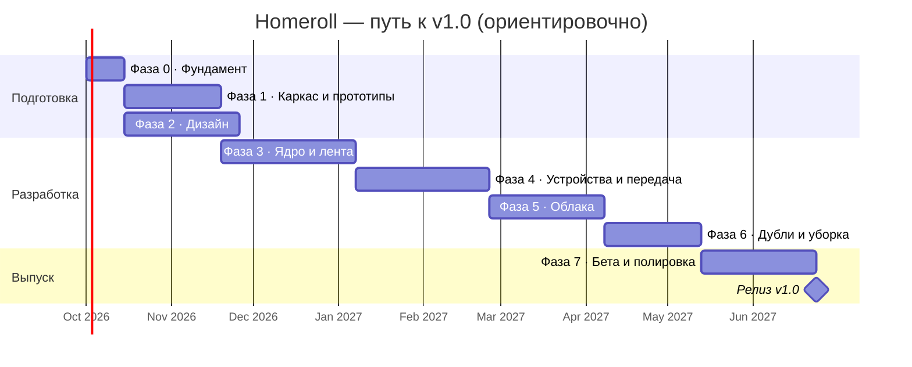

# Роадмап

Путь от идеи до **v1.0 в сторах**, а потом дальше. Первый публичный релиз — сразу v1.0.
До него версии `0.x` идут только в бету: TestFlight, закрытое тестирование, GitHub pre-release.

> Сроки ориентировочные: один разработчик, **~20 часов в неделю**. Фазы 1 и 2 идут параллельно.
> Каждой фазе соответствует эпик-issue с чек-листом.

## Фаза 0 · Фундамент (~2 недели)

**Цель:** всё готово, чтобы начать писать код.

- [x] Идея, видение, требования, архитектура, конвенции — эта документация.
- [ ] Настроить репозиторий: имя `homeroll`, публичный, защита `main`, безопасность, лейблы, вехи ([пошагово](process/repository-setup.md)).
- [ ] Проверить и купить домен (`homeroll.app` или аналог), проверить название в сторах.
- [ ] Mac на Apple Silicon (16+ ГБ), установить Xcode 26, Android Studio, JDK 21.
- [ ] Загранпаспорт → оплата Apple Developer Program (нужна к Фазе 7; до этого приложение ставится
      на свой iPhone бесплатно, с переподписью раз в 7 дней).

**Готово, когда:** на Mac собирается и запускается пустой шаблон KMP-приложения на всех платформах.

## Фаза 1 · Каркас и прототипы рисков (~5 недель)

**Цель:** снять главные технические риски до того, как писать продукт.

- [ ] Каркас проекта по [структуре](tech/project-structure.md): модули, `build-logic`, version catalog.
- [ ] CI: `ci.yml` (lint, тесты, сборки Android / desktop / iOS).
- [ ] Спайки (каждый — ветка `spike/*` и короткий отчёт в issue):

| № | Спайк | Критерий успеха |
|---|---|---|
| S-01 | PhotoKit из Kotlin/Native + сетка 10 000 превью в Compose на iPhone | плавная прокрутка, оригинал из iCloud скачивается |
| S-02 | MediaStore + сетка на Android, частичный доступ Android 14+ | то же |
| S-03 | Передача телефон → ПК: Ktor Server, самоподписанный сертификат, пиннинг, докачка, фон на iOS | ≥ 20 МБ/с по Wi-Fi, докачка после обрыва, понятно, что возможно в фоне на iOS |
| S-04 | mDNS на 3 платформах + системные разрешения локальной сети, фаервол Windows / macOS | телефон находит ПК за < 3 с |
| S-05 | OAuth PKCE: Яндекс, Dropbox, Microsoft; Google Photos Picker | вход без секрета в приложении, токен в Keychain / Keystore |
| S-06 | pHash на наборе из 1 000 реальных фото | «тот же кадр, другое качество» находится с точностью ≥ 95% |
| S-07 | Упаковка desktop: `.dmg`, `.msi`, трей, автозапуск | устанавливается и запускается на чистой системе |

**Готово, когда:** по каждому спайку есть решение; [ADR 0005](architecture/adr/0005-lan-transport.md) подтверждён или заменён.

## Фаза 2 · Дизайн (~6 недель, параллельно с Фазой 1)

**Цель:** бренд, дизайн-система и макеты ключевых экранов.

Состав и подход **обсуждаем отдельно** — см. [docs/design](design/README.md).

**Готово, когда:** есть макеты ключевых сценариев v1.0 и токены дизайн-системы, которые можно перенести в код.

## Фаза 3 · Ядро и единая лента (~7 недель) → `v0.1`

- [ ] `:shared:designsystem` по итогам Фазы 2.
- [ ] База данных, индексатор, интерфейс `MediaSource`.
- [ ] Источник «Галерея» (iOS, Android), источник «Папка» (desktop).
- [ ] Единая лента: сетка, группировка по датам, скроллер, просмотр фото / видео / Live Photo.
- [ ] Онбординг и разрешения.
- [ ] Desktop: окно, трей, выбор папки архива.

**Готово, когда:** на телефоне и ПК видна лента своих фото, 50 000 элементов прокручиваются без рывков.

## Фаза 4 · Устройства и передача (~7 недель) → `v0.2`

- [ ] Ключи устройств, сопряжение по QR, список устройств.
- [ ] Сервер приёма на ПК, раскладка по правилам, архив как источник.
- [ ] Отправка выбранных фото, очередь, докачка, отметки «в архиве».
- [ ] Автоархив (Android — фон; iOS — фон по возможности + при открытии).
- [ ] «Освободить место на телефоне» с правилом безопасности.

**Готово, когда:** семья из 2 телефонов неделю пользуется автоархивом без потерь и дублей в архиве.

## Фаза 5 · Облака (~6 недель) → `v0.3`

- [ ] Яндекс Диск, Dropbox, OneDrive, WebDAV.
- [ ] Google Photos Picker, импорт Google Takeout на ПК.
- [ ] Экран «Хранилища» с квотами и статусами.
- [ ] Регистрация OAuth-приложений, старт верификации Google.

**Готово, когда:** все источники v1.0 подключаются и синхронизируются инкрементально.

## Фаза 6 · Дубли и уборка (~5 недель) → `v0.4`

- [ ] Точные дубли, «тот же кадр в другом качестве», похожие серии.
- [ ] Правило безопасности `CleanupSafetyPolicy` + тесты на все краевые случаи.
- [ ] План уборки, подтверждение, удаление в корзины источников, журнал.

**Готово, когда:** на тестовом наборе из 5 источников уборка освобождает место и **ни разу** не удаляет последнюю копию.

## Фаза 7 · Бета и полировка (~6 недель) → `v1.0.0-rc`

- [ ] Доступность, локализация RU/EN, производительность, краевые случаи.
- [ ] Сайт: лендинг, политика конфиденциальности, поддержка, FAQ.
- [ ] Apple Developer Program (оплачен), Google Play / RuStore / Microsoft Store аккаунты.
- [ ] Бета: TestFlight, закрытое тестирование Google Play (12 тестеров × 14 дней), desktop pre-release.
- [ ] `release.yml`: подпись, нотаризация, загрузка в сторы.
- [ ] Материалы для сторов: скриншоты, описания, заметки для ревьюера с видео.

**Готово, когда:** выполнен [чек-лист публикации](release/distribution.md#чек-лист-перед-публикацией-v10).

## 🚀 Релиз v1.0

Тег `v1.0.0` → сборки во всех сторах и на GitHub Releases.

## После v1.0

| Версия | Что |
|---|---|
| **v1.1** | Передача через интернет (relay или iroh), уведомления |
| **v1.2** | Синхронизация настроек и подключённых облаков между устройствами (сквозное шифрование) |
| **v1.3** | Библиотека «Фото» на Mac, iCloud Drive, большие видео и скриншоты, сжатие видео |
| **v2.0** | Веб-приложение (Compose Web), семейный доступ, поиск по содержимому на устройстве |

## Риски

| Риск | Вероятность | Что делаем |
|---|---|---|
| Задержки регистрации Apple из РФ | высокая | регистрироваться заранее; до этого разработка и тесты на своём iPhone без платного аккаунта |
| Фоновые ограничения iOS для автоархива | высокая | спайк S-03, честный UX «откройте приложение дома» |
| Google ужесточит доступ ещё сильнее | средняя | Takeout-импорт и папки на ПК как запасной путь |
| Ошибка в уборке удалит единственную копию | низкая, но критичная | правило безопасности, тесты, удаление только в корзину, долгая бета |
| Проверка App Store не поймёт сценарий с ПК | средняя | приложение полезно без ПК + видео для ревьюера |
| Выгорание одного разработчика | средняя | жёсткий объём v1.0, «не входит в v1.0» соблюдаем строго |
| Название занято | низкая | проверить домен и сторы в Фазе 0 |
