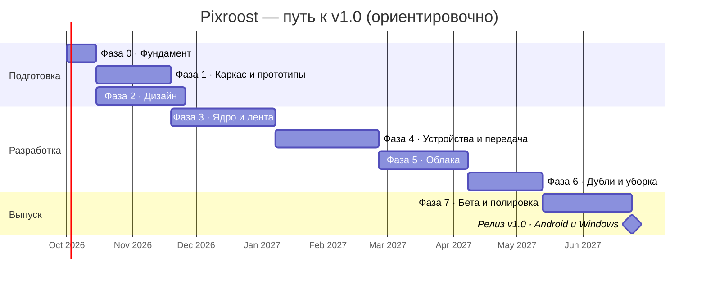

# Роадмап

Путь от идеи до **v1.0 в сторах**, а потом дальше. Первый публичный релиз — сразу v1.0.
До него версии `0.x` идут только в бету: закрытое тестирование, GitHub pre-release.

> **Сначала — всё бесплатное.** v1.0 выходит на **Android и Windows** (плюс Linux): для них не нужны
> ни Mac, ни платные аккаунты. **iOS и macOS** — отдельным этапом, когда появятся деньги на Mac
> и Apple Developer Program ($99 в год). Решение — [ADR 0008](architecture/adr/0008-android-windows-first.md).
>
> Сроки ориентировочные: один разработчик, **~20 часов в неделю**. Фазы 1 и 2 идут параллельно.
> Каждой фазе соответствует эпик-issue с чек-листом.

## Что бесплатно, а что нет

| Нужно | Для чего | Стоимость | Когда |
|---|---|---|---|
| ПК на Windows + Android Studio | Android, Windows, Linux, весь общий код | бесплатно | сейчас |
| Android-телефон | тесты на реальном устройстве | уже есть | сейчас |
| GitHub, GitHub Actions, GitHub Pages | код, CI, сайт и политика конфиденциальности | бесплатно (публичный репозиторий) | сейчас |
| RuStore, Microsoft Store, GitHub Releases | публикация v1.0 | бесплатно | Фаза 7 |
| Google Play | ещё один стор для Android | $25 один раз | по желанию |
| Домен `pixroost.app` | красивый адрес сайта | ~2 500 ₽ в год | когда появятся деньги |
| Mac на Apple Silicon | сборка iOS и macOS | дорого | этап «iOS и macOS» |
| Apple Developer Program | App Store, подпись macOS | $99 в год | этап «iOS и macOS» |

## Фаза 0 · Фундамент (~2 недели)

**Цель:** всё готово, чтобы начать писать код.

- [x] Идея, видение, требования, архитектура, конвенции — эта документация.
- [ ] Настроить репозиторий: имя `pixroost`, публичный, защита `main`, безопасность, лейблы, вехи ([пошагово](process/repository-setup.md)).
- [ ] Android Studio на Windows + плагин Kotlin Multiplatform, JDK 21, эмулятор или телефон для отладки.

**Позже, когда появятся деньги:** домен, Mac, Apple Developer Program (см. таблицу выше).

**Готово, когда:** Android Studio на Windows собирает и запускает пустой KMP-шаблон для Android и desktop (Windows).

## Фаза 1 · Каркас и прототипы рисков (~5 недель)

**Цель:** снять главные технические риски до того, как писать продукт.

- [ ] Каркас проекта по [структуре](tech/project-structure.md): модули, `build-logic`, version catalog.
      iOS-модули заводим сразу (они просто не собираются на Windows), чтобы потом не перекраивать проект.
- [ ] CI: `ci.yml` (lint, тесты, сборки Android и desktop; сборка iOS на macOS-раннере GitHub Actions — бесплатно).
- [ ] Спайки (каждый — ветка `spike/*` и короткий отчёт в issue):

| № | Спайк | Критерий успеха |
|---|---|---|
| S-02 | MediaStore + сетка 10 000 превью на Android, частичный доступ Android 14+ | плавная прокрутка |
| S-03 | Передача телефон → ПК: Ktor Server, самоподписанный сертификат, пиннинг, докачка | ≥ 20 МБ/с по Wi-Fi, докачка после обрыва |
| S-04 | mDNS на Android и Windows + разрешения локальной сети, фаервол Windows | телефон находит ПК за < 3 с |
| S-05 | OAuth PKCE: Яндекс, Dropbox, Microsoft; Google Photos Picker | вход без секрета в приложении, токен в Keystore |
| S-06 | pHash на наборе из 1 000 реальных фото | «тот же кадр, другое качество» находится с точностью ≥ 95% |
| S-07 | Упаковка desktop: `.msi` (и MSIX для Microsoft Store), трей, автозапуск | устанавливается и запускается на чистой Windows |

Спайки для Apple — на этапе [«iOS и macOS»](#этап-ios-и-macos): S-01 (PhotoKit и сетка на iPhone),
фоновая передача на iOS, `.dmg` с нотаризацией.

**Готово, когда:** по каждому спайку есть решение; [ADR 0005](architecture/adr/0005-lan-transport.md) подтверждён или заменён.

## Фаза 2 · Дизайн (~6 недель, параллельно с Фазой 1)

**Цель:** бренд, дизайн-система и макеты ключевых экранов.

Состав и подход **обсуждаем отдельно** — см. [docs/design](design/README.md).

**Готово, когда:** есть макеты ключевых сценариев v1.0 и токены дизайн-системы, которые можно перенести в код.

## Фаза 3 · Ядро и единая лента (~7 недель) → `v0.1`

- [ ] `:shared:designsystem` по итогам Фазы 2.
- [ ] База данных, индексатор, интерфейс `MediaSource`.
- [ ] Источник «Галерея» (Android), источник «Папка» (desktop).
- [ ] Единая лента: сетка, группировка по датам, скроллер, просмотр фото и видео.
- [ ] Онбординг и разрешения.
- [ ] Desktop: окно, трей, выбор папки архива.

**Готово, когда:** на телефоне и ПК видна лента своих фото, 50 000 элементов прокручиваются без рывков.

## Фаза 4 · Устройства и передача (~7 недель) → `v0.2`

- [ ] Ключи устройств ([ADR 0007](architecture/adr/0007-device-keys-and-trust.md)), сопряжение по QR, список устройств.
- [ ] Права устройств, отзыв, приглашение с телефона, журнал подключений, блокировка приложения.
- [ ] Сервер приёма на ПК, раскладка по правилам, архив как источник.
- [ ] Отправка выбранных фото, очередь, докачка, отметки «в архиве».
- [ ] Автоархив в фоне (Android, WorkManager).
- [ ] «Освободить место на телефоне» с правилом безопасности.

**Готово, когда:** семья из 2 телефонов неделю пользуется автоархивом без потерь и дублей в архиве.

## Фаза 5 · Облака (~6 недель) → `v0.3`

- [ ] Яндекс Диск, Dropbox, OneDrive, WebDAV.
- [ ] Google Photos Picker, импорт Google Takeout на ПК.
- [ ] Экран «Хранилища» с квотами и статусами.
- [ ] Регистрация OAuth-приложений, старт верификации Google (сайт — на GitHub Pages).

**Готово, когда:** все источники v1.0 подключаются и синхронизируются инкрементально.

## Фаза 6 · Дубли и уборка (~5 недель) → `v0.4`

- [ ] Точные дубли, «тот же кадр в другом качестве», похожие серии.
- [ ] Правило безопасности `CleanupSafetyPolicy` + тесты на все краевые случаи.
- [ ] План уборки, подтверждение, удаление в корзины источников, журнал.

**Готово, когда:** на тестовом наборе из 5 источников уборка освобождает место и **ни разу** не удаляет последнюю копию.

## Фаза 7 · Бета и полировка (~6 недель) → `v1.0.0-rc`

- [ ] Доступность, локализация RU/EN, производительность, краевые случаи.
- [ ] Сайт на GitHub Pages: лендинг, политика конфиденциальности, пользовательское соглашение, поддержка, FAQ.
- [ ] Юридическая проверка политики и соглашения.
- [ ] Аккаунты разработчика: RuStore, Microsoft Store (бесплатно); Google Play — по желанию.
- [ ] Бета: APK и `.msi` как pre-release на GitHub, тестировщики из знакомых.
- [ ] `release.yml`: подпись Android, сборка `.msi` и MSIX, загрузка в сторы.
- [ ] Материалы для сторов: скриншоты, описания.

**Готово, когда:** выполнен [чек-лист публикации](release/distribution.md#чек-лист-перед-публикацией-v10).

## 🚀 Релиз v1.0

Тег `v1.0.0` → Android (RuStore, GitHub Releases) и Windows (Microsoft Store, GitHub Releases), Linux — на GitHub Releases.

## Этап «iOS и macOS»

Начинаем, **когда появятся деньги** на Mac и Apple Developer Program. Может выйти в любой версии `1.x`.
Общий код, интерфейс и протокол к этому моменту уже готовы — остаётся платформенная часть.

- [ ] Mac, Xcode, Apple Developer Program.
- [ ] Спайки: S-01 (PhotoKit из Kotlin/Native, сетка на iPhone, оригиналы из iCloud), фоновая передача на iOS
      (background `URLSession` с пиннингом), mDNS и разрешение локальной сети на iOS.
- [ ] Галерея iPhone с iCloud Фото, Live Photo, автоархив в рамках ограничений iOS.
- [ ] macOS: `.dmg`, подпись Developer ID, нотаризация.
- [ ] TestFlight → App Store.

## После v1.0

| Версия | Что |
|---|---|
| **v1.1** | Передача через интернет (relay или iroh), уведомления |
| **v1.2** | Синхронизация настроек и подключённых облаков между устройствами (сквозное шифрование) |
| **v1.3** | Библиотека «Фото» на Mac, iCloud Drive, большие видео и скриншоты, сжатие видео |
| **v2.0** | Веб-приложение (Compose Web), семейный доступ, поиск по содержимому на устройстве |

Этап «iOS и macOS» идёт параллельно этим версиям — как только появятся средства.

## Риски

| Риск | Вероятность | Что делаем |
|---|---|---|
| Нет денег на Mac и аккаунт Apple ещё долго | средняя | v1.0 без Apple; общий код не зависит от iOS, этап «iOS и macOS» — отдельно |
| Задержки регистрации Apple из РФ | высокая | регистрироваться заранее, как только будут деньги и загранпаспорт |
| Фоновые ограничения iOS для автоархива | высокая | спайк на этапе «iOS и macOS», честный UX «откройте приложение дома» |
| Google ужесточит доступ ещё сильнее | средняя | Takeout-импорт и папки на ПК как запасной путь |
| Ошибка в уборке удалит единственную копию | низкая, но критичная | правило безопасности, тесты, удаление только в корзину, долгая бета |
| Выгорание одного разработчика | средняя | жёсткий объём v1.0, «не входит в v1.0» соблюдаем строго |
| Название займут, пока нет домена | низкая | зарезервировать название в RuStore и Microsoft Store при регистрации аккаунтов |
