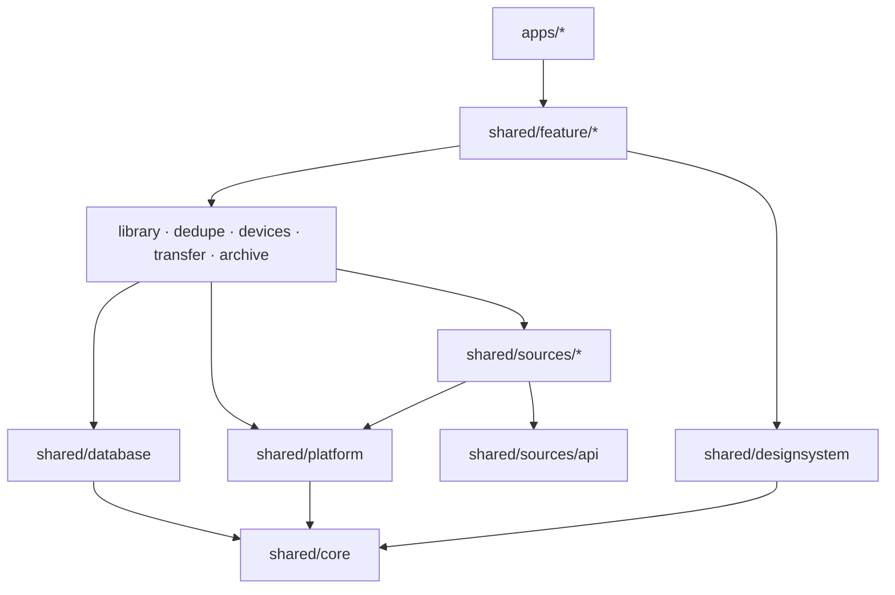

# Структура проекта

Код ещё не создан. Ниже — целевая структура, которую создаём в Фазе 1.

## Дерево

```
pixroost/
├── apps/
│   ├── android/                 # точка входа Android (Activity, манифест, иконки)
│   ├── ios/                     # Xcode-проект: SwiftUI-оболочка, Info.plist, entitlements
│   ├── desktop/                 # точка входа desktop: окно, трей, упаковка dmg/msi/deb
│   └── macos-native/            # Swift Package: SwiftUI и стекло для Mac, вызывается из desktop через FFM
│
├── shared/
│   ├── core/                    # базовые модели, Result, время, логирование
│   ├── database/                # Room 3: сущности, DAO, схемы в schemas/, миграции
│   ├── platform/                # интерфейсы платформы + actual-реализации
│   │                            #   галерея, файлы, секреты, mDNS, фон, OAuth-браузер
│   ├── designsystem/            # тема, токены, компоненты (Px*)
│   ├── library/                 # единая медиатека, индексатор
│   ├── dedupe/                  # хэши, pHash, группы, правило безопасности
│   ├── devices/                 # ключи, сопряжение, список устройств
│   ├── transfer/                # протокол, очередь, клиент (телефон) и сервер (ПК)
│   ├── archive/                 # правила раскладки, приём файлов (desktop)
│   ├── sources/
│   │   ├── api/                 # интерфейс MediaSource, общие модели
│   │   ├── gallery/             # PhotoKit / MediaStore
│   │   ├── yandex/
│   │   ├── dropbox/
│   │   ├── onedrive/
│   │   ├── webdav/
│   │   ├── gphotos/             # Google Photos Picker
│   │   ├── takeout/             # импорт Google Takeout (desktop)
│   │   └── folder/              # папки и диски (desktop)
│   └── feature/                 # экраны: ViewModel + Compose UI
│       ├── onboarding/
│       ├── library/
│       ├── storages/
│       ├── cleanup/
│       ├── devices/
│       └── settings/
│
├── server/
│   └── relay/                   # v1.1: relay на Ktor
├── website/                     # лендинг → GitHub Pages
├── build-logic/                 # convention-плагины Gradle
├── gradle/libs.versions.toml    # версии зависимостей
└── docs/                        # документация
```

## Правила зависимостей между модулями



- Зависимости идут **только вниз**. `feature` не знает о конкретных облаках, `sources` не знают о UI.
- `feature`-модули не зависят друг от друга: навигацию между ними собирает `apps/*`.
- `designsystem` не зависит от бизнес-логики.
- Каждый коннектор облака — отдельный модуль: можно собрать приложение без любого из них.

## Имена

| Что | Правило | Пример |
|---|---|---|
| Gradle-модуль | kebab-case по пути | `:shared:sources:yandex`, `:shared:feature:cleanup` |
| Пакет | `app.pixroost.<путь>` | `app.pixroost.sources.yandex`, `app.pixroost.feature.cleanup` |
| Android applicationId | `app.pixroost` | — |
| iOS bundle ID | `app.pixroost` | — |
| Desktop | `app.pixroost.desktop` | — |

Идентификаторы `app.pixroost` не требуют покупки домена `pixroost.app`: сторы проверяют только уникальность.
Важно не менять их после первой публикации (bundle ID и applicationId потом не меняются).

## Source sets

```
shared/<module>/src/
├── commonMain/      # общий код
├── commonTest/
├── androidMain/     # Android-реализации (actual)
├── iosMain/         # iOS-реализации: Kotlin/Native + вызовы Apple API
├── desktopMain/     # JVM desktop
└── desktopTest/
```

## iOS-оболочка

- Xcode-проект в `apps/ios` подключает общий фреймворк через прямую интеграцию KMP
  (задача Gradle `embedAndSignAppleFrameworkForXcode` в фазе сборки).
- Swift Package-зависимости, если понадобятся, — через поддержку SwiftPM в Kotlin 2.4.
- В Swift: `@main App`, навигация на SwiftUI (`TabView`, `NavigationStack`, `.toolbar`, `.sheet`), хост для
  экранов Compose (`ComposeUIViewController`) и всё, что Compose не умеет или делает хуже системы
  (например, камера для QR через VisionKit) — [ADR 0009](../architecture/adr/0009-liquid-glass-native-navigation.md).
- `PrivacyInfo.xcprivacy` — обязателен ([privacy manifest для KMP](https://kotlinlang.org/docs/multiplatform/multiplatform-privacy-manifest.html)).

## Нативные части macOS

- `apps/macos-native` — Swift Package с динамической библиотекой: панель в строке меню и окно настроек
  на SwiftUI, системное стекло (`NSGlassEffectView`) под сайдбаром и панелью инструментов окна Compose.
- Функции библиотеки экспортируются как C-функции (`@_cdecl`), `apps/desktop` вызывает их через
  Foreign Function & Memory API из JDK 25. Вызовы AppKit — только в главном потоке.
- Собирается задачей Gradle (`swift build`) только на macOS и попадает в ресурсы приложения в `.dmg`.
  На Windows и Linux этой части нет.
