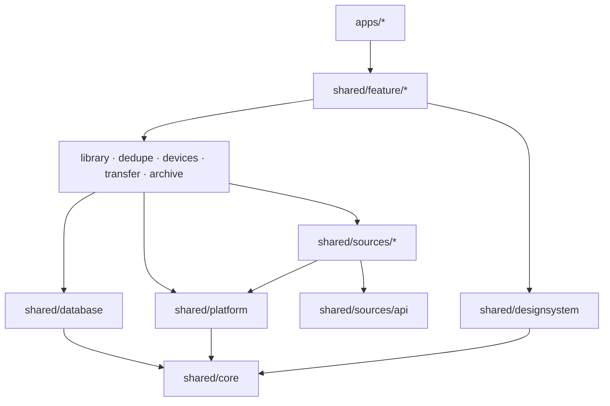

# Структура проекта

Каркас создан в шаге 1.1: `apps/android`, `apps/desktop`, `shared/core`, `shared/designsystem` и `build-logic`.
iOS-оболочка — в шаге A.2: `apps/ios` и `apps/ios-framework`.
Остальные модули ниже — целевая структура, они появляются по [плану](../development-plan.md).

## Дерево

```
pixroost/
├── apps/
│   ├── android/                 # точка входа Android (Activity, манифест, иконки)
│   ├── ios/                     # Xcode-проект: SwiftUI-оболочка, Info.plist, entitlements
│   ├── ios-framework/           # фреймворк PixroostKit: общий код для Xcode-проекта
│   ├── desktop/                 # точка входа desktop: окно, трей, упаковка dmg/msi/deb
│   └── macos-native/            # Swift Package: SwiftUI и стекло для Mac, вызывается из desktop через FFM
│
├── shared/
│   ├── core/                    # базовые модели, Result, время, логирование
│   ├── database/                # Room 3: сущности, DAO, схемы в schemas/, миграции
│   ├── platform/                # интерфейсы платформы + actual-реализации
│   │                            #   галерея, файлы, секреты, mDNS, фон, OAuth-браузер
│   ├── designsystem/            # тема, токены, компоненты (Px*)
│   ├── library/                 # единая медиатека, индексатор
│   ├── dedupe/                  # хэши, pHash, группы, правило безопасности
│   ├── devices/                 # ключи, сопряжение, список устройств
│   ├── transfer/                # протокол, очередь, клиент (телефон) и сервер (ПК)
│   ├── archive/                 # правила раскладки, приём файлов (desktop)
│   ├── sources/
│   │   ├── api/                 # интерфейс MediaSource, общие модели
│   │   ├── gallery/             # PhotoKit / MediaStore
│   │   ├── yandex/
│   │   ├── dropbox/
│   │   ├── onedrive/
│   │   ├── webdav/
│   │   ├── gphotos/             # Google Photos Picker
│   │   ├── takeout/             # импорт Google Takeout (desktop)
│   │   └── folder/              # папки и диски (desktop)
│   └── feature/                 # экраны: ViewModel + Compose UI
│       ├── onboarding/
│       ├── library/
│       ├── storages/
│       ├── cleanup/
│       ├── devices/
│       └── settings/
│
├── server/
│   └── relay/                   # v1.1: relay на Ktor
├── website/                     # лендинг → GitHub Pages
├── build-logic/                 # convention-плагины Gradle
├── config/detekt.yml            # правила detekt, отличия от настроек по умолчанию
├── gradle/libs.versions.toml    # версии зависимостей
└── docs/                        # документация
```

## Сборка

- Версии библиотек и плагинов — в `gradle/libs.versions.toml`, уровни Android SDK — там же
  (`androidCompileSdk`, `androidTargetSdk`, `androidMinSdk`).
- Android Gradle plugin — не новее версии, которую поддерживает последняя стабильная Android Studio
  ([таблица совместимости](https://developer.android.com/build/releases/about-agp)); иначе проект не синхронизируется.
- Общие настройки модулей — convention-плагины в `build-logic`:

| Плагин | Для чего | Что делает |
|---|---|---|
| `pixroost.kmp.library` | модули `shared/*` | Kotlin Multiplatform: Android, desktop (`jvm("desktop")`), `iosArm64`, `iosSimulatorArm64`; JDK 25; байткод Android — Java 17; `commonTest` запускается и на desktop, и как Android host-тесты |
| `pixroost.compose` | модули `shared/*` с интерфейсом | Compose Multiplatform: runtime, foundation, ui, Material 3 |
| `pixroost.android.application` | `apps/android` | Android-приложение на AGP 9 со встроенной поддержкой Kotlin и Compose |
| `pixroost.desktop.application` | `apps/desktop` | Compose for Desktop на JVM 25 |

- Проверки кода — Spotless с ktlint, detekt и Kover — настроены в корневом `build.gradle.kts` для всего репозитория
  ([как запускать](../process/conventions.md#проверки-кода)). Kover подключает `pixroost.kmp.library`.
- Namespace модуля выводится из пути: `:shared:sources:yandex` → `app.pixroost.sources.yandex`.
- Gradle сам запускается на JDK 25 (`gradle/gradle-daemon-jvm.properties`), компиляция — через toolchain Gradle.
  Подробности — [JDK 25](../process/jdk.md).
- iOS-таргеты объявлены во всех `shared`-модулях и собираются только на macOS; на Windows и Linux Gradle
  их пропускает (`kotlin.native.ignoreDisabledTargets=true`).

## Правила зависимостей между модулями



- Зависимости идут **только вниз**. `feature` не знает о конкретных облаках, `sources` не знают о UI.
- `feature`-модули не зависят друг от друга: навигацию между ними собирает `apps/*`.
- `designsystem` не зависит от бизнес-логики.
- Каждый коннектор облака — отдельный модуль: можно собрать приложение без любого из них.

## Имена

| Что | Правило | Пример |
|---|---|---|
| Gradle-модуль | kebab-case по пути | `:shared:sources:yandex`, `:shared:feature:cleanup` |
| Пакет | `app.pixroost.<путь>` | `app.pixroost.sources.yandex`, `app.pixroost.feature.cleanup` |
| Android applicationId | `app.pixroost` | — |
| iOS bundle ID | `app.pixroost` | — |
| Desktop | `app.pixroost.desktop` | — |

Идентификаторы `app.pixroost` не требуют покупки домена `pixroost.app`: сторы проверяют только уникальность.
Важно не менять их после первой публикации (bundle ID и applicationId потом не меняются).

## Source sets

```
shared/<module>/src/
├── commonMain/      # общий код
├── commonTest/
├── androidMain/     # Android-реализации (actual)
├── iosMain/         # iOS-реализации: Kotlin/Native + вызовы Apple API
├── desktopMain/     # JVM desktop
└── desktopTest/
```

## iOS-оболочка

- `apps/ios-framework` собирает статический фреймворк `PixroostKit` (`iosArm64`, `iosSimulatorArm64`) из модулей
  `shared/*` и отдаёт Swift экраны Compose как функции, которые возвращают `UIViewController`.
- Xcode-проект в `apps/ios` подключает фреймворк через прямую интеграцию KMP
  (задача Gradle `embedAndSignAppleFrameworkForXcode` в фазе сборки).
- Файлы в `apps/ios/Pixroost/` Xcode подхватывает сам (папка синхронизируется с проектом), править `project.pbxproj`
  ради нового Swift-файла не нужно.
- Общие настройки сборки — `apps/ios/Configuration/Config.xcconfig`. Команда подписи и свой bundle ID — в
  `Local.xcconfig` рядом, он не попадает в git ([как настроить](../process/dev-environment.md#запуск-на-своём-iphone)).
- Строки SwiftUI — в String Catalog `Localizable.xcstrings`: ключ на английском, перевод на русский.
- Swift Package-зависимости, если понадобятся, — через поддержку SwiftPM в Kotlin 2.4.
- В Swift: `@main App`, навигация на SwiftUI (`TabView`, `NavigationStack`, `.toolbar`, `.sheet`), хост для
  экранов Compose (`ComposeUIViewController`) и всё, что Compose не умеет или делает хуже системы
  (например, камера для QR через VisionKit) — [ADR 0009](../architecture/adr/0009-liquid-glass-native-navigation.md).
- `apps/ios/Pixroost/PrivacyInfo.xcprivacy` — privacy manifest: трекинга нет, данные не собираются; причины для API,
  которые вызывает Compose Multiplatform: время изменения файлов (`C617.1`) и время с загрузки системы (`35F9.1`)
  ([privacy manifest для KMP](https://kotlinlang.org/docs/multiplatform/multiplatform-privacy-manifest.html)).
  Когда код Pixroost начинает вызывать API из [списка Apple](https://developer.apple.com/documentation/bundleresources/describing-use-of-required-reason-api),
  причину добавляем в тот же файл.

## Нативные части macOS

- `apps/macos-native` — Swift Package с динамической библиотекой: панель в строке меню и окно настроек
  на SwiftUI, системное стекло (`NSGlassEffectView`) под сайдбаром и панелью инструментов окна Compose.
- Функции библиотеки экспортируются как C-функции (`@_cdecl`), `apps/desktop` вызывает их через
  Foreign Function & Memory API из JDK 25. Вызовы AppKit — только в главном потоке.
- Собирается задачей Gradle (`swift build`) только на macOS и попадает в ресурсы приложения в `.dmg`.
  На Windows и Linux этой части нет.
