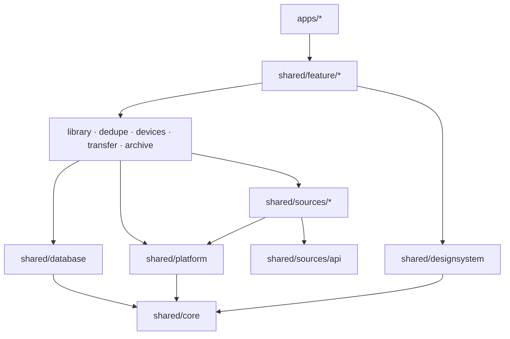

# Структура проекта

Код ещё не создан. Ниже — целевая структура, которую создаём в Фазе 1.

## Дерево

```
homeroll/
├── apps/
│   ├── android/                 # точка входа Android (Activity, манифест, иконки)
│   ├── ios/                     # Xcode-проект: SwiftUI-оболочка, Info.plist, entitlements
│   └── desktop/                 # точка входа desktop: окно, трей, упаковка dmg/msi/deb
│
├── shared/
│   ├── core/                    # базовые модели, Result, время, логирование
│   ├── database/                # схема и запросы SQLDelight, миграции
│   ├── platform/                # интерфейсы платформы + actual-реализации
│   │                            #   галерея, файлы, секреты, mDNS, фон, OAuth-браузер
│   ├── designsystem/            # тема, токены, компоненты (Hr*)
│   ├── library/                 # единая медиатека, индексатор
│   ├── dedupe/                  # хэши, pHash, группы, правило безопасности
│   ├── devices/                 # ключи, сопряжение, список устройств
│   ├── transfer/                # протокол, очередь, клиент (телефон) и сервер (ПК)
│   ├── archive/                 # правила раскладки, приём файлов (desktop)
│   ├── sources/
│   │   ├── api/                 # интерфейс MediaSource, общие модели
│   │   ├── gallery/             # PhotoKit / MediaStore
│   │   ├── yandex/
│   │   ├── dropbox/
│   │   ├── onedrive/
│   │   ├── webdav/
│   │   ├── gphotos/             # Google Photos Picker
│   │   ├── takeout/             # импорт Google Takeout (desktop)
│   │   └── folder/              # папки и диски (desktop)
│   └── feature/                 # экраны: ViewModel + Compose UI
│       ├── onboarding/
│       ├── library/
│       ├── storages/
│       ├── cleanup/
│       ├── devices/
│       └── settings/
│
├── server/
│   └── relay/                   # v1.1: relay на Ktor
├── website/                     # лендинг → GitHub Pages
├── build-logic/                 # convention-плагины Gradle
├── gradle/libs.versions.toml    # версии зависимостей
└── docs/                        # документация
```

## Правила зависимостей между модулями



- Зависимости идут **только вниз**. `feature` не знает о конкретных облаках, `sources` не знают о UI.
- `feature`-модули не зависят друг от друга: навигацию между ними собирает `apps/*`.
- `designsystem` не зависит от бизнес-логики.
- Каждый коннектор облака — отдельный модуль: можно собрать приложение без любого из них.

## Имена

| Что | Правило | Пример |
|---|---|---|
| Gradle-модуль | kebab-case по пути | `:shared:sources:yandex`, `:shared:feature:cleanup` |
| Пакет | `app.homeroll.<путь>` | `app.homeroll.sources.yandex`, `app.homeroll.feature.cleanup` |
| Android applicationId | `app.homeroll` | — |
| iOS bundle ID | `app.homeroll` | — |
| Desktop | `app.homeroll.desktop` | — |

Идентификаторы `app.homeroll` предполагают домен `homeroll.app` — проверить доступность и купить до
регистрации приложений в сторах (bundle ID после публикации не меняется).

## Source sets

```
shared/<module>/src/
├── commonMain/      # общий код
├── commonTest/
├── androidMain/     # Android-реализации (actual)
├── iosMain/         # iOS-реализации: Kotlin/Native + вызовы Apple API
├── desktopMain/     # JVM desktop
└── desktopTest/
```

## iOS-оболочка

- Xcode-проект в `apps/ios` подключает общий фреймворк через прямую интеграцию KMP
  (задача Gradle `embedAndSignAppleFrameworkForXcode` в фазе сборки).
- Swift Package-зависимости, если понадобятся, — через поддержку SwiftPM в Kotlin 2.4.
- В Swift: `@main App`, хост для Compose (`ComposeUIViewController`), то, что проще сделать нативно
  (например, камера для QR через VisionKit).
- `PrivacyInfo.xcprivacy` — обязателен ([privacy manifest для KMP](https://kotlinlang.org/docs/multiplatform/multiplatform-privacy-manifest.html)).
